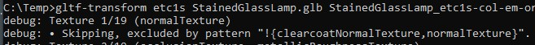
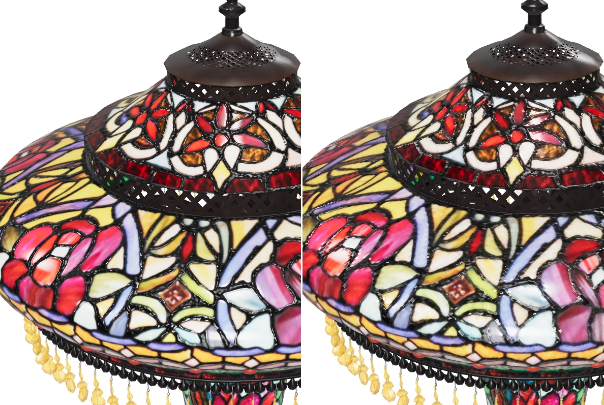
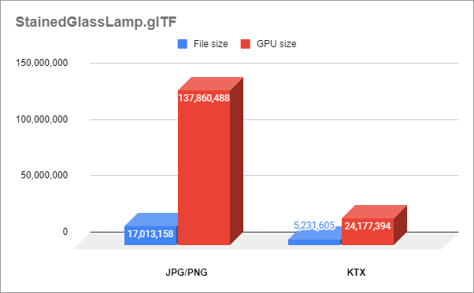
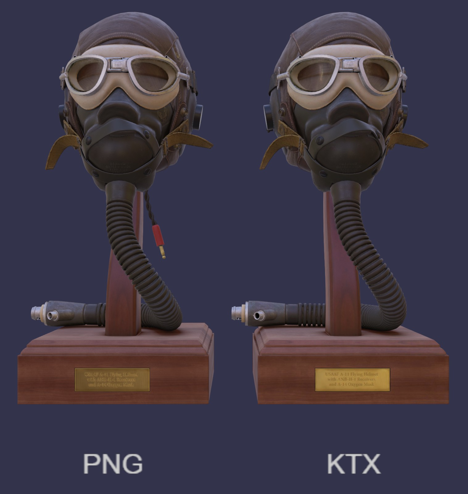
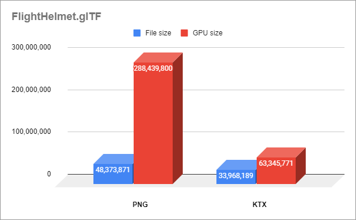

# KTX Asset Compression Workflow


How artists and content creators can compress glTF textures with [Basis Universal texture compression](https://github.com/KhronosGroup/KTX-Software) and the glTF extension [KHR_texture_basisu](https://github.com/KhronosGroup/glTF/blob/master/extensions/2.0/Khronos/KHR_texture_basisu/).

## Why use KTX?

Textures in a glTF file can be compressed into .ktx2 GPU textures using Basis Universal compression, which offers faster GPU upload and less GPU memory consumption than PNG or JPEG textures. PNGs and JPEGs are fully uncompressed when loaded in GPU memory, but KTX stays compressed on the GPU. 


Authoring compressed GPU textures often requires more careful tuning to maintain image quality, but this extra effort is worthwhile for applications that need to maintain a smooth framerate while uploading images, or where GPU memory is limited. In certain cases they may also have smaller file sizes than PNG or JPEG textures, but this is not guaranteed. If performance is important, the benefits of compressed GPU textures may outweigh an increase in file size.

There are two Basis Universal compression methods: ETC1S and UASTC. ETC1S offers lower size and lower quality than UASTC. In some cases it may be useful to double the resolution of the texture to minimize compression artifacts while still retaining a smaller file size. Consider using less aggressive compression settings for normal maps than for other texture types: you may want to use UASTC for normal maps and ETC1S for other textures, for example.

## Installing KTX Software

1. Go to the [KTX-Software releases](https://github.com/KhronosGroup/KTX-Software/releases). 

1. Find the release you want (usually the latest). At the bottom of the release, look for the Assets section, and click the triangle to expand it.

1. Download the asset for your operating system, and install it.

1. For example, the Windows installer looks like this: 


5. Add KTX-Software to the system path. This is not required, but it will make it easier to run the command line tool. 


## Installing Node.js

Node.js includes the NPM node package manager, which allows you to run the javascript tool [glTF-Transform](https://gltf-transform.donmccurdy.com/cli.html), for compressing textures inside glTF using KTX texture compression.

1. Go to https://nodejs.org/en/

1. Download the asset for your operating system, and install it.

1. For example, the Windows installer looks like this: 


4. You can skip “Tools for Native Modules” step by unsetting the checkbox here:


## Installing glTF-Transform

[glTF-Transform](https://gltf-transform.donmccurdy.com/cli.html) is used for compressing textures inside glTF using KTX texture compression.

1. Open the OS command prompt (or PowerShell in Windows). 

1. Install glTF-Transform:

``` 
npm install --global @gltf-transform/cli
```

## Compressing to KTX with glTF-Transform

With everything installed, you can now compress your glTF files. There are different compression options available; here are a few  methods to get you started. 

1. Compress all textures using ETC1S except the normal maps:
 
```
gltf-transform etc1s input.glb output.glb --slots "!normalTexture" --verbose
```
* `gltf-transform` is the tool itself
* `etc1s` is the compression method. This compresses more than uastc, but tends to create more blocky artifacts.
* `input.glb` is the file you want to compress, with PNG and/or JPEG textures inside of it.
* `output.glb` is the file you want to save, with the new KTX textures.
* `--slots` lets you include or exclude texture types, which you specify in the next part.
* `"!normalTexture"` tells glTF Transform to compress all textures in the GLB using ETC1S except for the normal maps. 
* `--verbose shows` step by step what glTF Transform is doing. This is helpful as a progress bar to make sure it’s working, and to help you figure out if you included the right options or not. For example if you use --verbose you should see the normal maps being skipped: 
  

2. Compress normal maps with UASTC and all others with ETC1S:
```
gltf-transform uastc input.glb output1.glb --slots "normalTexture" --verbose
gltf-transform etc1s output1.glb output2.glb --verbose
```
* Note this is two separate commands. The 1st command compresses only normal maps using UASTC. The 2nd command then compresses all the remaining textures using ETC1S. Start the 2nd command only after the 1st is complete. 
* The 2nd command doesn’t need a `--slots "!normalTexture"` argument to omit the normal maps, because glTF-Transform will not recompress existing KTX files. It only compresses non-KTX textures.

3. Compress all textures with ETC1S except normal maps and ORM maps (which will stay as PNGs), and use the highest quality compression:
```
gltf-transform etc1s input.glb output.glb --slots "!{normalTexture,occlusionTexture,metallicRoughnessTexture}" --quality 255
```
* Several slots are being ignored together, all the normal maps and ORM maps will not be compressed.
* `--quality 255` will use the highest possible quality to calculate the compression, but will compress the slowest. Use this when quality is more important than conversion speed.

On Windows there’s no progress indicator during compression, only the blinking cursor. You can include the `--verbose` flag which will show more details while it’s working. The process will show the “info” status line when it’s complete, and it will indicate the before and after file sizes.

Check the output file carefully in your viewer of choice. Look closely, there may be undesirable compression artifacts on different texture types: basecolor, alpha, normal maps, roughness, metalness, occlusion, emissive, etc. You can find a list of glTF viewers using the [glTF Project Explorer](http://github.khronos.org/glTF-Project-Explorer/).

Try different compression settings! To learn all about the settings, type either of these in the command line:

* `gltf-transform help etc1s`
* `gltf-transform help uastc`

To see a list of texture slots in a GLB use the command `gltf-transform inspect input.glb` This will show the dimensions and file sizes for each texture. This is particularly useful to identify the names of the `--slots` so you can apply different compression settings to different texture types. It also shows the file size for each texture and the size it will be in GPU memory. 


## Converting to KTX with RapidCompact

[RapidCompact](https://rapidcompact.com/) is a commercial cloud-based service for optimizing 3D models. They offer a wizard-based approach to compression & optimization.


1. Create an account and upload your model https://app.rapidcompact.com/app/models/upload

1. Click on the Optimize button and choose Custom.

1. Choose the settings you wish. There are helpful tooltips, and you can learn more via the Documentation link at the bottom of the page.

1. In the Export And Compression step, set the output format to glTF,  change the Texture Compression to Ktx2,  then choose Optimize.

1. When RapidCompact is done processing, you’ll see a report page with an embedded 3D view, where you can preview and download your compressed models.


## Converting to KTX with Gestaltor

[Gestaltor](https://gestaltor.io/) is a visual glTF editor to directly edit glTF and/or GLB files. The tool is free for non-commercial usage.

1. Select the image to convert in the Images widget. The image is then visible in the Inspector widget:


Please note, that the current Mime Type is `image/png` and the file size is around **51.32 KB**.

2. Press on the Convert image button and select ktx2 as the Format.


3. Choose the KTX Compression, which is ETC1S + BasisLZ in this case. Press Apply.


The image does now have the Mime Type `image/ktx2`, and the file size has been reduced to **8.84 KB**.

4. The required `KHR_texture_basisu` extension is activated automatically in the glTF for the texture using this image:


After storing the 3D asset as a glTF file, the KTX asset is available on the file system as well.

## Compressing Individual Textures


It’s also possible to convert individual image files to KTX with Basis Universal compression, using the command line tool [Khronos Texture Tools](https://github.khronos.org/KTX-Software/ktxtools/toktx.html) (`toktx`).

This tool offers the most flexibility and control over all compression options. After converting a texture, the new ktx files will need to be inserted into a glTF file, by either replacing existing textures or being added as new ones.

### ETC1S / BasisLZ Parameters
The `toktx` command line tool exposes three main codec parameters related to ETC1S / BasisLZ:
* **Use ETC1S / BasisLZ** (`--bcmp`)
* **ETC1S / BasisLZ Compression Level** (`--clevel <level>`): Integer value of [0, 5] range, default is 1. Higher values are slower, but give higher quality.
* **ETC1S / BasisLZ Quality Level** (`--qlevel <level>`): Integer value of [1, 255] range, default is 128. Lower gives better compression/lower quality/faster. Higher gives less compression/higher quality/slower.

### UASTC Parameters
The `toktx` command line tool exposes four UASTC codec parameters:
* **Quality Level** (`--uastc [<level>]`): Integer value of [0, 4] range, default is 2. 0 - fastest/lowest quality, 3 - slowest practical option, 4 - impractically slow / highest achievable quality.
* **RDO Quality Scalar** (`--uastc_rdo_q [<quality>]`): Floating-point value of [0.001, 10.0] range, default is 1.0. Lower values lead to higher quality / larger LZ-compressed files, higher values - to lower quality / smaller LZ compressed files. Good range to try is [0.2, 4.0].
* **RDO Dictionary Byte Length** (`--uastc_rdo_d [<size>]`): Integer value of [256, 65536] range, default is 32768. Lower values lead to faster but less efficient compression.
* **Zstandard Compression Level** (`--zcmp [<level>]`): Apply Zstandard lossless compression after UASTC compression. The range is [1, 22], the default is 3. Lower values lead to faster processing but give less compression. Values above 20 should be used with caution as they require more memory during compression.

## Converting Between .glTF and .GLB Formats

To compress with KTX, it’s easiest to work with a binary GLB file since all the textures are contained in one asset. This isn’t strictly necessary, but it does make processing easier.

You can use [glTF Pipeline](https://github.com/CesiumGS/gltf-pipeline) to convert from a glTF with external binaries (BIN and textures) into a single GLB. 

1. Open the OS command prompt (or PowerShell in Windows). 

1. Because you installed Node.js earlier, you can now easily install glTF Pipeline:
```
npm install --global @gltf-pipeline/cli
```
3. Convert a glTF into a GLB:
```
gltf-pipeline -i input.gltf -b
```

This is a lossless conversion. The glTF assets (JSON, .bin, and images) are simply packed into a single binary GLB file. Note that the GLB is not necessarily a smaller file than the sum of the separate glTF/bin/image files, because the separate files are already compressed..

You may additionally apply [Draco mesh compression](https://github.com/google/draco) using glTF Pipeline, however this is generally a lossy operation, so it should be done as a final step after KTX conversion.

## Compression Examples

### StainedGlassLamp

This [stained glass lamp model](https://github.com/KhronosGroup/glTF-Sample-Models/pull/292) from Wayfair uses JPG and PNG textures in a range of dimensions from 2048 to 256. The overall file size is 17 MB, but it increases to 138 MB in GPU memory because the textures must be uncompressed to use them for rendering.



Left: JPG & PNG textures. Right: KTX textures. 

Compressing the textures with KTX reduces the file size to 5 MB, and it becomes only 24 MB in GPU memory. That's about 31% the file size, and just 18% the GPU size!




From an average viewing distance, the artifacts on the lamp are fairly minor, but the savings are drastic.


### FlightHelmet

This [flight helmet model](https://github.com/KhronosGroup/glTF-Sample-Models/tree/master/2.0/FlightHelmet) from Microsoft uses twelve 2048x2048 PNGs and three 1024x1024 PNGs.



Left: PNG textures, file size 48.37 MB, GPU size 288.44 MB. Right: KTX textures, file size 33.97 MB, GPU size 63.35 MB.



Live demo of the Flight Helmet, comparing PNG and KTX: https://playground.babylonjs.com/#PEFFA8#8

## KTX Tips and Tricks

* The [3D Commerce Asset Creation Guidelines](https://github.com/KhronosGroup/3DC-Asset-Creation/blob/main/asset-creation-guidelines/RealtimeAssetCreationGuidelines.md) have important information about how to create well-formed models.
* Before compression, textures should be stored as 8 bit per channel RGB or RGBA. Application developers are encouraged to evaluate uncompressed textures fidelity and performance within actual scenes before applying compression.
* Power-of-two dimensions are almost always required for glTF textures: 2048, 1024, 512, etc. glTF-Transform has a --power-of-two flag to do the resizing for you, but starting with the intended size is better. Even when targeting newer platforms that support non-power-of-two texture dimensions, the texture dimensions still must be multiples of 4 to work with Basis Universal.
* Dimensions of subsequent levels must follow the usual mip-mapping rule - truncating division by 2 but always greater than zero. For example, the base level of 20x12 would have the following mip levels: 10x6, 5x3, 2x1, 1x1. Content pipeline tools could either prepare mip levels themselves or rely on KTX-Software to create downscaled textures during compression.
* Texture resolution should be appropriate for your delivery target, usually no larger than 2048x2048. Sometimes an Occlusion/Roughness/Metalness (ORM) texture has less detail than the Base Color texture, so it can be 1/4 the resolution of the Base Color… if a Base Color texture is 1024x1024, the ORM could be 512x512 and still look great on the model.
* Conversely, in some cases it may actually be useful to increase the resolution of the texture, to minimize compression artifacts while still retaining a smaller file size. To do this, double the dimensions (e.g. 512x512 to 1024x1024) without interpolation, before compressing them, then compare the results. 
* For best results when authoring new textures, use texture dilation and minimize prominent UV seams.
* If you can use a numerical value instead of a texture, that’s one less texture you have to compress! For example, if the Base Color on your model is a single color then it’s better to use a baseColorFactor (four numbers) instead of a baseColorTexture (a texture file). 
* Whenever possible, align the UVs along a 4x4 pixel grid. KTX compression schemes compress the image in blocks, each of which is 4x4 pixels. When a smooth feature in a texture crosses the 4x4 border, it may suddenly get very choppy.  You’ll see less compression artifacts whenever you can avoid crossing these 4x4 blocks.
* KTX compression will preserve the best visual quality when starting with high quality source files. Start with textures in PNG format if possible. The lossy compression in JPEG textures should be avoided as it may cause additional artifacts in the end result. KTX is going to amplify those errors, causing more blocky artifacts or more blurry results.
* Textures with drastically different values in each of the color channels (R,G,B) will often cause more artifacts than those with similar values. Photos for example typically have similar values, whereas normal maps usually have a lot of variation from channel to channel. Because of this, photo-based textures can often be compressed more, while showing fewer artifacts. Consider using less aggressive compression settings for occlusion/roughness/metalness maps or normal maps than for other texture types: you may want to use UASTC instead, or PNG if file size is a concern.
