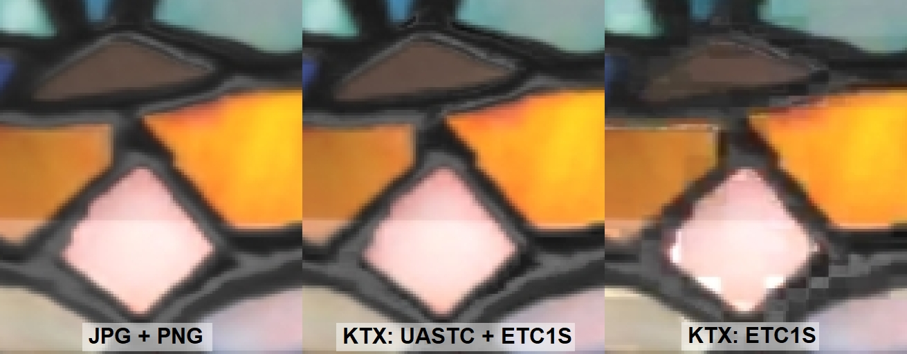

# KTX Artist Guide


How artists and content creators can compress textures for [glTF](https://www.khronos.org/gltf/) using the [KTX texture container](https://registry.khronos.org/KTX/specs/2.0/ktxspec.v2.html) with [Basis Universal texture compression](https://github.com/KhronosGroup/KTX-Software#readme).

KTX stays compressed when in memory. This is unique among glTF texture formats. All textures must be loaded into GPU memory for rendering, but most files have to be wholly uncompressed before they can be rendered. KTX is compressed into a machine-friendly universal format, and is automatically translated at loading time into the optimal format for each hardware device.


KTX is best used when loading time must be fast and when memory conservation is paramount. This is often the case in multi-asset scenes like room planners, game levels, and product configurators. 

When creating assets for single-model display, it may be preferrable to reduce file size and not be concerned about memory size. In this case another texture format may be a better choice, for example WEBP or JPEG which can offer very small file sizes, at the expense of being wholly uncompressed when loaded onto the GPU. 

## KTX Compression Guides ##

Guides for artist-friendly KTX software that have graphical user interfaces:

* [KTX Guide for Gestaltor](subpages\KTXArtistGuide_Gestaltor.md) is a visual glTF editor with KTX support. Useful for editing individual glTF files, or batch processing via the command line. Free for non-commercial use on glTF files under 2mb. Subscription removes all limits, and gives access to the command line. 
* [KTX Guide for glTF-Compressor](subpages\KTXArtistGuide_glTF-Compressor.md) is a free web-based 3D viewer with KTX support. Useful for compressing individual glTF files; can save settings for automation elsewhere.
* [KTX Guide for RapidCompact](subpages\KTXArtistGuide_RapidCompact.md) is an online platform for optimization of 3D data with KTX support.  Free for non-commercial use. Useful for optimizing individual glTF files, or automating batches of files.

Additional KTX tools are available, which may not be as artist friendly but tend to offer the greateast flexibility and control:
* [KTX Guide for glTF-Transform](subpages\KTXArtistGuide_glTF-Transform.md) is a command-line tool for glTF editing, including KTX compression.
* [KTX Guide for toktx](subpages\KTXArtistGuide_toktx.md) is a command-line tool for KTX compression of textures.
* [KTX 2.0 Tools](KTXTools.md) lists more KTX tools.

## Why use KTX?

Textures in a glTF file can be compressed into .ktx2 GPU textures using Basis Universal compression, which offers faster GPU upload and less GPU memory consumption than JPEG or PNG or WEBP textures. Those formats are fully uncompressed when loaded in GPU memory, but KTX stays compressed on the GPU.

Authoring compressed GPU textures often requires more careful tuning to maintain image quality, but this extra effort is worthwhile for applications that need to maintain a smooth framerate while uploading images, or where GPU memory is limited. In certain cases they may also have smaller file sizes than PNG or JPEG textures, but this is not guaranteed. If performance is important, the benefits of compressed GPU textures may outweigh an increase in file size.

There are two Basis Universal compression methods: ETC1S and UASTC.

ETC1S offers greater compression and works better with large areas of solid colors or mostly monochromatic values; it doesn’t produce quality results on complex textures, or textures with areas of saturated color next to each other. ETC1S is useful when texture variation is not that important. It's especially good with non-PBR textures, for example with toon rendering or with interface assets.

UASTC offers higher visual quality for high-contrast high-detail color textures. It works better with "packed" textures that have very different values in RGB channels, including Occlusion/Roughness/Metalness (ORM), Normal, and textures used by [glTF Extensions](https://github.com/KhronosGroup/glTF/tree/master/extensions) like KHR_materials_clearcoat which uses the Red channel for clearcoatTexture and the Green channel for clearcoatRoughnessTexture. 

## glTF Texture Formats ##

glTF supports four texture formats. Each has different capabilities; choose the appropriate format for the task.

1. JPEG
    * `General guidelines: Use for small file sizes, and wide compatibility. Download is fast, but loading time is slow. Uses a lot of memory, does not support alpha.`
    * Does not stay compressed in memory. 
    * Wide compatibility.
    * File sizes can be small.
    * Good image quality. Lossy compression, can be noisy. 
    * Does not support alpha.<br/>
1. PNG
    * `General guidelines: Use for highest image quality, wide compatibility, and alpha channel. Loading time is slow, uses a lot of memory, and file sizes can be large.`
    * Does not stay compressed in memory.
    * Wide compatibility.
    * File sizes can be very large, unless mostly flat colors.
    * Perfect image quality overall. Lossless compression, but can use palettized compression. 
    * Supports alpha.<br/>
1. KTX
    * `General guidelines: Use for fastest loading time, and smallest memory footprint. Download may be slower.` 
    * Stays compressed in memory.
    * Renderer must support [KHR_texture_basisu](https://github.com/KhronosGroup/glTF/blob/main/extensions/2.0/Khronos/KHR_texture_basisu/README.md).
    * File sizes are similar to JPEG but can be larger.
    * Good image quality. Lossy compression, can be blocky. 
    * Supports alpha.<br/>
1. WEBP
    * `General guidelines: Use for smallest file size, and alpha channel. Download is fastest, but loading time is slow, and uses a lot of memory. If normal maps are too noisy, use JPEG or PNG instead.` 
    * Does not stay compressed in memory.
    * Renderer must support [EXT_texture_webp](https://github.com/KhronosGroup/glTF/blob/main/extensions/2.0/Vendor/EXT_texture_webp/README.md).
    * File sizes are usually the smallest, much smaller than JPEG.
    * Good image quality. Lossy compression, can be blurry and noisy. 
    * Supports alpha.<br/>

## Compression Examples

### StainedGlassLamp

This [stained glass lamp model](https://github.com/KhronosGroup/glTF-Sample-Assets/tree/main/Models/StainedGlassLamp) from Wayfair uses JPG and PNG textures. The overall file size is about 13 MB, but it increases to 96 MB in GPU memory because the textures must be uncompressed to use them for rendering.

The lamp in the middle and at the right are compressed with KTX. The middle lamp uses the highest quality compression settings and the artifacts are nearly imperceptible, but the savings are drastic. Compressing the textures with KTX reduces the file size to 10 MB and it becomes 21 MB in GPU memory, which is about 81% of the file size and just 22% of the GPU size!



> 📝 NOTE: 
> These compressions can be examined interactively via these live demonstrations: 
>- JPG+PNG vs. high quality UASTC+ETC1S https://playground.babylonjs.com/full.html#YD2TXP#23
>- JPG+PNG vs. ETC1S only https://playground.babylonjs.com/full.html#YD2TXP#22 

The lamp on the far right is compressed only with ETC1S which causes obvious block compression artifacts. This may be acceptable if file and GPU sizes are more important than quality. This demonstrates the importance of fine-tuning compression codecs and settings; as the UASTC+ETC1S example shows these artifacts can be nearly eliminated by implementing more refined compression settings, as demonstrated below.

For the high-quality UASTC+ETC1S version, the textures were compressed from PNG source files using [toktx](https://github.com/KhronosGroup/KTX-Software#readme) via a combination of compression settings that favored high quality. UASTC was used for packed textures (ORM, Normal, etc.) and ETC1S for Base Color and Emissive textures, however exceptions were made based on analyzing results... the `glass_basecolor-alpha` and `glass_emissive` textures were changed from ETC1S to UASTC since these were prominently displayed on the model and contained a lot of color variation.

```
set mipmap=--genmipmap
set uastc=--t2 --encode uastc --uastc_quality 4 --uastc_rdo_l .5 --uastc_rdo_d 65536 --zcmp 22
set uastchq=--t2 --encode uastc --uastc_quality 4 --uastc_rdo_l .25 --uastc_rdo_d 65536 --zcmp 22
set etc1s=--t2 --encode etc1s --clevel 4 --qlevel 255
toktx %mipmap% %etc1s% StainedGlassLamp_base_basecolor.ktx2 StainedGlassLamp_base_basecolor.png
toktx %mipmap% %etc1s% StainedGlassLamp_base_emissive.ktx2 StainedGlassLamp_base_emissive.png
toktx %mipmap% %uastc% StainedGlassLamp_glass_basecolor-alpha.ktx2 StainedGlassLamp_glass_basecolor-alpha.png
toktx %mipmap% %uastc% StainedGlassLamp_glass_emissive.ktx2 StainedGlassLamp_glass_emissive.png
toktx %mipmap% %etc1s% StainedGlassLamp_grill_basecolor-alpha.ktx2 StainedGlassLamp_grill_basecolor-alpha.png
toktx %mipmap% %etc1s% StainedGlassLamp_grill_emissive.ktx2 StainedGlassLamp_grill_emissive.png
toktx %mipmap% %etc1s% StainedGlassLamp_hardware_basecolor.ktx2 StainedGlassLamp_hardware_basecolor.png
toktx %mipmap% %etc1s% StainedGlassLamp_hardware_emissive.ktx2 StainedGlassLamp_hardware_emissive.png
toktx %mipmap% %uastchq% --assign_oetf linear --assign_primaries none StainedGlassLamp_base_normal.ktx2 StainedGlassLamp_base_normal.png
toktx %mipmap% %uastchq% --assign_oetf linear --assign_primaries none StainedGlassLamp_base_occlusion-rough-metal.ktx2 StainedGlassLamp_base_occlusion-rough-metal.png
toktx %mipmap% %uastc% --assign_oetf linear --assign_primaries none StainedGlassLamp_bulbs_occlusion-rough-metal.ktx2 StainedGlassLamp_bulbs_occlusion-rough-metal.png
toktx %mipmap% %uastchq% --assign_oetf linear --assign_primaries none StainedGlassLamp_glass_normal.ktx2 StainedGlassLamp_glass_normal.png
toktx %mipmap% %uastc% --assign_oetf linear --assign_primaries none StainedGlassLamp_glass_occlusion-rough-metal_transmission.ktx2 StainedGlassLamp_glass_occlusion-rough-metal_transmission.png
toktx %mipmap% %uastc% --assign_oetf linear --assign_primaries none StainedGlassLamp_glass_transmission-clearcoat.ktx2 StainedGlassLamp_glass_transmission-clearcoat.png
toktx %mipmap% %uastchq% --assign_oetf linear --assign_primaries none StainedGlassLamp_grill_normal.ktx2 StainedGlassLamp_grill_normal.png
toktx %mipmap% %uastc% --assign_oetf linear --assign_primaries none StainedGlassLamp_grill_occlusion-rough-metal.ktx2 StainedGlassLamp_grill_occlusion-rough-metal.png
toktx %mipmap% %uastchq% --assign_oetf linear --assign_primaries none StainedGlassLamp_hardware_normal.ktx2 StainedGlassLamp_hardware_normal.png
toktx %mipmap% %uastc% --assign_oetf linear --assign_primaries none StainedGlassLamp_hardware_occlusion-rough-metal.ktx2 StainedGlassLamp_hardware_occlusion-rough-metal.png
toktx %mipmap% %uastc% --assign_oetf linear --assign_primaries none StainedGlassLamp_steel_occlusion-rough-metal.ktx2 StainedGlassLamp_steel_occlusion-rough-metal.png
```


As shown above, KTX compression vastly improves the GPU memory cost of the model. 

### Duck

The [Duck](https://github.com/KhronosGroup/glTF-Sample-Assets/tree/main/Models/Duck) from Sony uses a single 512x512 PNG texture. The mostly-solid color values make it a great candidate for ETC1S compression because it causes few block compression artifacts. It saves only about 2% in file size, but saves about 82% in GPU memory.


Left: PNG texture, file size 118 KB, GPU size 1.5 MB. Right: KTX texture, file size 116 KB, GPU size 277 KB.


The duck texture was compressed with glTF-Transform using this command:

```
gltf-transform etc1s duck.gltf duck.gltf --verbose
```

## KTX Tips and Tricks

* Make sure to evaluate the quality and performance of uncompressed textures in actual scenes before applying compression; you may not need compression at all!
* Use values ionstead of textures. If you can use a numerical value instead of a texture, that’s one less texture you have to compress! For example, if the Base Color on your model is a single color then it’s better to use a baseColorFactor (four numbers) instead of a baseColorTexture (a texture file).
* Use 8-bit source files. Before compression, textures should be stored as 8 bit per channel RGB or RGBA.
* Start with uncompressed source files. KTX compression will preserve the best visual quality when starting with high quality source files. Start with textures in PNG format if possible. The lossy compression in JPEG textures should be avoided as it may cause additional artifacts in the end result. KTX is going to amplify those errors, causing more blocky artifacts or more blurry results.
* Power-of-two dimensions are almost always required for glTF textures: 2048, 1024, 512, etc. glTF-Transform has a --power-of-two flag to do the resizing for you, but starting with the intended size is better. Even when targeting newer platforms that support non-power-of-two texture dimensions, the texture dimensions still must be multiples of 4 to work with KHR_texture_basisu.
* Texture resolution should be appropriate for your delivery target, usually no larger than 2048x2048. Sometimes an Occlusion/Roughness/Metalness (ORM) texture has less detail than the Base Color texture, so it can be 1/4 the resolution of the Base Color… if a Base Color texture is 1024x1024, the ORM could be 512x512 and still look great on the model.
* Sometimes higher-resolution is better! In some cases it may actually be useful to increase the resolution of the texture, to minimize compression artifacts while still retaining a smaller file size. To do this, double the dimensions (e.g. 512x512 to 1024x1024) without interpolation, before compressing them, then compare the results.
* For best results when authoring new textures, use texture dilation and minimize prominent UV seams.
* Whenever possible, align the UVs along a 4x4 pixel grid. KTX compression schemes compress the image in blocks, each of which is 4x4 pixels. When a smooth feature in a texture crosses the 4x4 border, it may suddenly get very choppy. You’ll see less compression artifacts whenever you can avoid crossing these 4x4 blocks.
* Textures with drastically different values in each of the color channels (R,G,B) will often cause more artifacts than those with similar values. Photos for example typically have similar values, whereas normal maps usually have a lot of variation from channel to channel. Because of this, photo-based textures can often be compressed more, while showing fewer artifacts. Consider using less aggressive compression settings for occlusion/roughness/metalness maps or normal maps than for other texture types: you may want to use UASTC instead, or PNG if file size is a concern.
* Dimensions of lower mips must follow the usual mip-mapping rule - truncating division by 2 but always greater than zero. For example, the base level of 20x12 would have the following mip levels: 10x6, 5x3, 2x1, 1x1. Content pipeline tools could either prepare mip levels themselves or rely on KTX-Software to create downscaled textures during compression.
* The [3D Commerce Asset Creation Guidelines](https://github.com/KhronosGroup/3DC-Asset-Creation/blob/main/asset-creation-guidelines/RealtimeAssetCreationGuidelines.md) have important information about how to create well-formed models.
