# KTX Artist Guide


How artists and content creators can compress glTF textures with [Basis Universal texture compression](https://github.com/KhronosGroup/KTX-Software) and the glTF extension [KHR_texture_basisu](https://github.com/KhronosGroup/glTF/blob/master/extensions/2.0/Khronos/KHR_texture_basisu/).

## Why use KTX?

Textures in a glTF file can be compressed into .ktx2 GPU textures using Basis Universal compression, which offers faster GPU upload and less GPU memory consumption than PNG or JPEG textures. PNGs and JPEGs are fully uncompressed when loaded in GPU memory, but KTX stays compressed on the GPU.

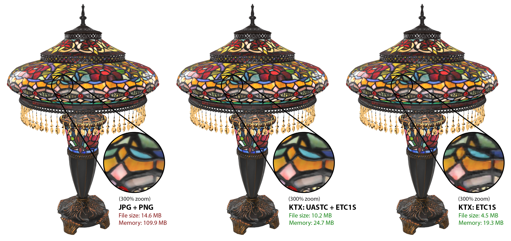

Authoring compressed GPU textures often requires more careful tuning to maintain image quality, but this extra effort is worthwhile for applications that need to maintain a smooth framerate while uploading images, or where GPU memory is limited. In certain cases they may also have smaller file sizes than PNG or JPEG textures, but this is not guaranteed. If performance is important, the benefits of compressed GPU textures may outweigh an increase in file size.

There are two Basis Universal compression methods: ETC1S and UASTC.

ETC1S offers greater compression and works better with large areas of solid colors or mostly monochromatic values; it doesn’t produce quality results on complex textures, or textures with areas of saturated color next to each other. ETC1S is useful when texture variation is not that important. It's especially good with non-PBR textures, for example with toon rendering or with interface assets.

UASTC offers higher visual quality for high-contrast high-detail color textures. It works better with "packed" textures that have very different values in RGB channels, including Occlusion/Roughness/Metalness (ORM), Normal, and textures used by [glTF Extensions](https://github.com/KhronosGroup/glTF/tree/master/extensions) like KHR_materials_clearcoat which uses the Red channel for clearcoatTexture and the Green channel for clearcoatRoughnessTexture.

## Installing KTX Software

1. Go to the [KTX-Software releases](https://github.com/KhronosGroup/KTX-Software/releases).

1. Find the release you want (usually the latest). At the bottom of the release, look for the Assets section, and click the triangle to expand it.

1. Download the asset for your operating system, and install it.

1. For example, the Windows installer looks like this:

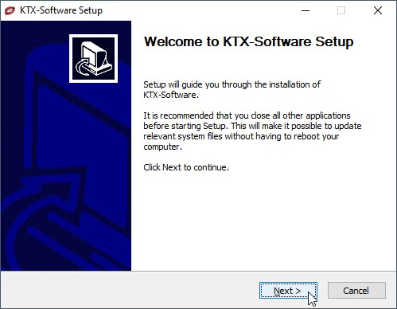

5. Add KTX-Software to the system path. This is not required, but it will make it easier to run the command line tool.

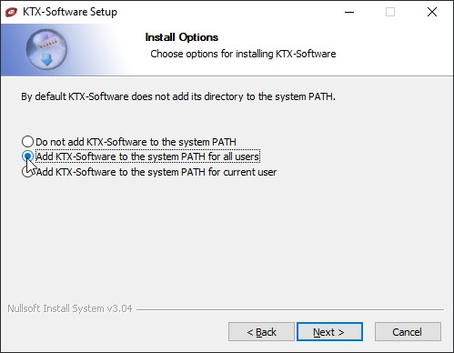

## Installing Node.js

Node.js includes the NPM node package manager, which allows you to run the javascript tool [glTF-Transform](https://gltf-transform.donmccurdy.com/cli.html), for compressing textures inside glTF using KTX texture compression.

1. Go to https://nodejs.org/en/

1. Download the asset for your operating system, and install it.

1. For example, the Windows installer looks like this:

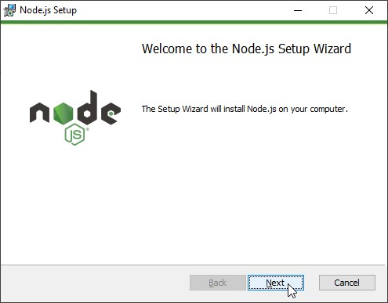

4. You can skip “Tools for Native Modules” step by unsetting the checkbox here:


## Installing glTF-Transform

[glTF-Transform](https://gltf-transform.donmccurdy.com/cli.html) is useful for compressing a bunch of textures inside a glTF model.

1. Open the OS command prompt (or PowerShell in Windows).

1. Install glTF-Transform:

``` 
npm install --global @gltf-transform/cli
```

## Compressing to KTX with glTF-Transform

With everything installed, you can now compress your glTF files. There are different compression options available; here are a few methods to get you started.

### METHOD 1: UASTC + ETC1S

Compress Normal and Occlusion/Roughness/Metalness (ORM) textures with UASTC, and all others with ETC1S:
```
gltf-transform uastc input.glb output1.glb --level 4 --rdo 4 --slots "{normalTexture,occlusionTexture,metallicRoughnessTexture}" --zstd 18 --verbose

gltf-transform etc1s output1.glb output2.glb --quality 255 --verbose
```

* `gltf-transform` is the tool itself.
* `uastc` is the compression method. This compresses less than etc1s, but tends to create less blocky artifacts. It creates less artifacts on textures that have uncorrelated RGB values, like ORM maps, than ETC1S does.
* `input.glb` is the file you want to compress, with PNG and/or JPEG textures inside of it.
* `output1.glb` is the file you want to save, with the new KTX textures. The first step creates a GLB with some textures in UASTC, keeping the rest in their original formats. The second step then compresses the remaining originals with ETC1S.
* `--level 4` is a high quality setting. It produces the highest achievable quality, but can be very slow. If it's too slow, try 3 instead.
* `--rdo 4` is a medium quality setting, but makes smaller files. Full range is [.001, 10.0]. Lower values yield higher quality/larger LZ compressed files, higher values yield lower quality/smaller LZ compressed files. A good range to try is [.25, 10]. For normal maps, try a range of [.25, .75].
* `--slots` lets you include or exclude texture types, using the following setting:
* `"{normalTexture,occlusionTexture,metallicRoughnessTexture}"` tells glTF Transform to compress only normal and ORM textures with UASTC. To see a list of texture slots in a GLB use the command `gltf-transform inspect input.glb` This will show the dimensions and file sizes for each texture. This is particularly useful to identify the names of the `--slots` so you can apply different compression settings to different texture types.
* `--zstd 18` applies supercompression. Compression level range is [1, 22], default 18, 0 is uncompressed. Lower values are faster but give less compression. Values above 20 should be used with caution as they require more memory.
* `--verbose` shows step by step what glTF Transform is doing. On Windows there’s no progress indicator during compression, only the blinking cursor. `--verbose` is helpful as a progress bar to make sure it’s working, and to help you figure out if you included the right options or not.
* `--quality 255` in the second step tells glTF-Transform to use the highest quality for ETC1S, but it applies less compression, and it takes longer to compress the files. Use this when quality is more important than conversion speed.

Note this is two separate commands. The 1st command compresses only normal & ORM maps using UASTC. The 2nd command then compresses all the remaining textures using ETC1S. Start the 2nd command only after the 1st is complete. The 2nd command doesn’t need a `--slots "!{normalTexture,occlusionTexture,metallicRoughnessTexture}"` argument to omit the normal/ORM maps, because glTF-Transform will not recompress existing KTX files. It only compresses non-KTX textures.

### METHOD 2: UASTC

Compress all textures with UASTC:
```
gltf-transform uastc input.glb output.glb --level 4 --rdo-quality 4 --zstd 18 --verbose
```
* This can produce a larger file, but usually shows less compression artifacts.

### METHOD 3: ETC1S

Compress all textures using ETC1S:

```
gltf-transform etc1s input.glb output.glb --verbose
```
* This produces the smallest files, but usually creates a lot of blocky artifacts.
* Use this when file size and memory size are more important than highest visual quality.
* This also works well if textures use mostly homogenous colors. See the Duck example below.

### MORE METHODS

Try different compression settings and combinations; adjust to your overall goals for size & quality. Isolate settings to specific texture slots. Textures respond differently from each other to the various compression settings, so a little experimentation can yield better results.

To learn more about the available settings, type either of these in the command line:
* `gltf-transform help etc1s`
* `gltf-transform help uastc`

## Evaluate the Output

Check compressed files carefully in your viewer of choice.
* Look closely, there may be undesirable compression artifacts on different texture types: basecolor, alpha, normal maps, roughness, metalness, occlusion, emissive, etc.
* The [glTF Sample Viewer](https://github.khronos.org/glTF-Sample-Viewer-Release/) is a good renderer to try. You can find a list of glTF viewers using the [glTF Project Explorer](http://github.khronos.org/glTF-Project-Explorer/).

Use the `INSPECT` command to examine the file sizes for each texture and the sizes they will be in GPU memory.
```
gltf-transform inspect input.glb --format md
```
An example output of the `INSPECT` command:
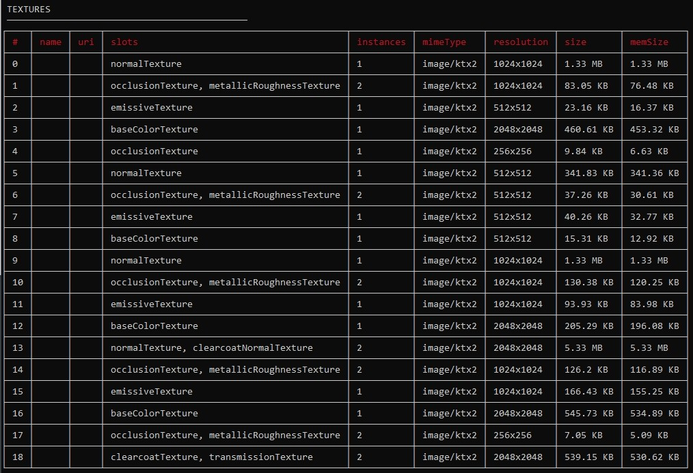

MD format is easier to read directly, and can be pasted directly into a Markdown document. CSV format is great for loading into a spreadsheet for further data crunching and analysis.

## Converting to KTX with RapidCompact

[RapidCompact](https://rapidcompact.com/) is a commercial cloud-based service for optimizing 3D models. They offer a wizard-based approach to compression & optimization.

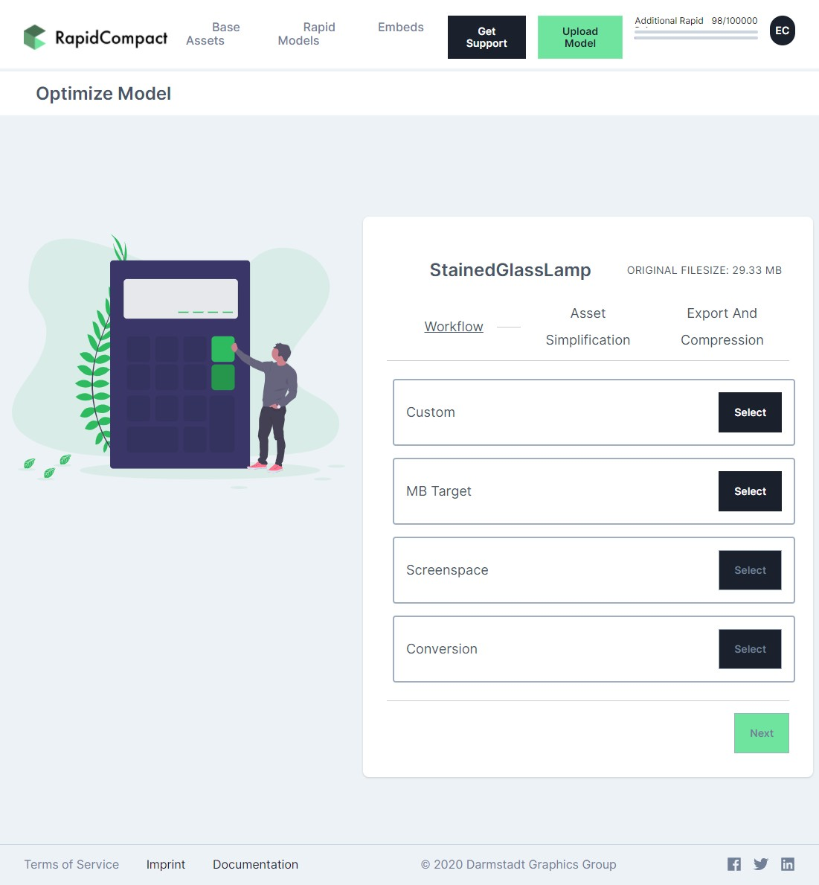

1. Create an account and upload your model https://app.rapidcompact.com/app/models/upload

1. Click on the Optimize button and choose Custom.

1. Choose the settings you wish. There are helpful tooltips, and you can learn more via the Documentation link at the bottom of the page.

1. In the Export And Compression step, set the output format to glTF,  change the Texture Compression to Ktx2 (by default using Basis ETCS1, but you can also choose UASTC encoding),  then choose Optimize.

1. When RapidCompact is done processing, you’ll see a report page with an embedded 3D view, where you can preview and download your compressed models.

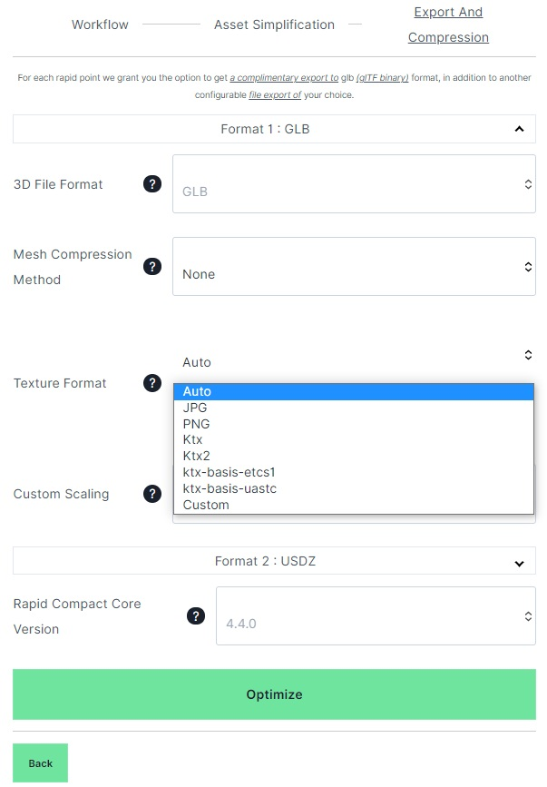

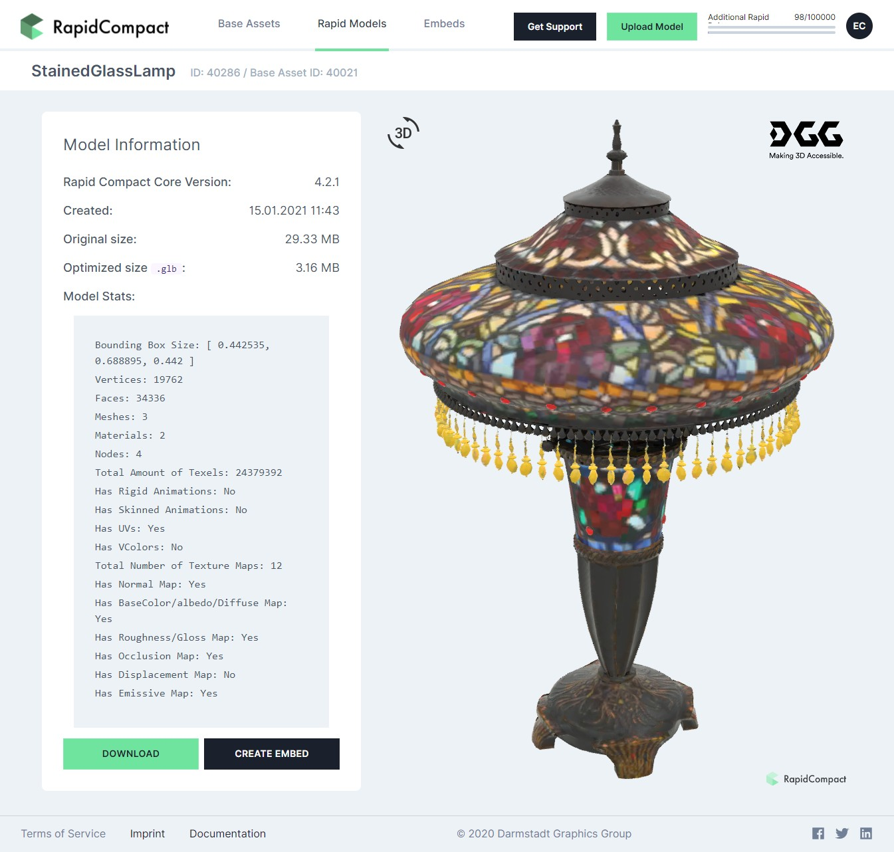

## Converting to KTX with Gestaltor

[Gestaltor](https://gestaltor.io/) is a visual glTF editor to directly edit glTF and/or GLB files. The tool is free for non-commercial usage.

1. Select the image to convert in the Images widget. The image is then visible in the Inspector widget:

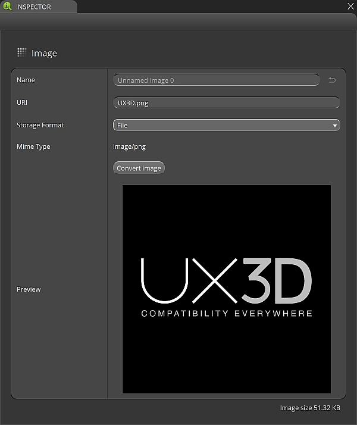

Please note, that the current Mime Type is `image/png` and the file size is around **51.32 KB**.

2. Press on the Convert image button and select ktx2 as the Format.

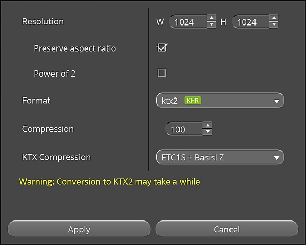

3. Choose the KTX Compression, which is ETC1S + BasisLZ in this case. Press Apply.

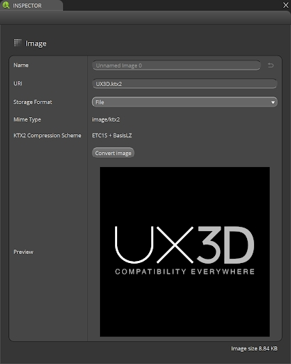

The image does now have the Mime Type `image/ktx2`, and the file size has been reduced to **8.84 KB**.

4. The required `KHR_texture_basisu` extension is activated automatically in the glTF for the texture using this image:

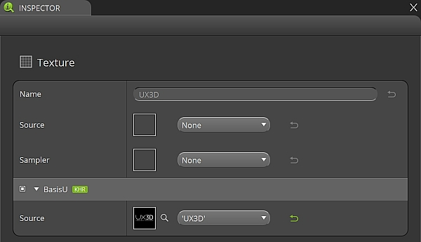

After storing the 3D asset as a glTF file, the KTX asset is available on the file system as well.

## Compressing Individual Textures

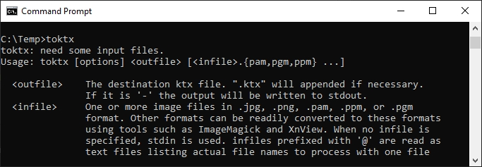

It’s also possible to convert individual image files to KTX with Basis Universal compression, using the command line tool `toktx`, one of the [Khronos Texture Tools](https://github.com/KhronosGroup/KTX-Software#readme).

This tool offers the most flexibility and control over all compression options. After converting a texture, the new KTX files will need to be referenced by your glTF file, by either replacing existing textures or adding them as new ones.

### ETC1S / BasisLZ Parameters

The `toktx` command line tool exposes three main codec parameters related to ETC1S / BasisLZ:
* **Use ETC1S / BasisLZ** (`--bcmp`)
* **ETC1S / BasisLZ Compression Level** (`--clevel <level>`): Integer value of [0, 5] range, default is 1. Higher values are slower, but give higher quality.
* **ETC1S / BasisLZ Quality Level** (`--qlevel <level>`): Integer value of [1, 255] range, default is 128. Lower gives better compression/lower quality/faster. Higher gives less compression/higher quality/slower.

### UASTC Parameters
The `toktx` command line tool exposes four UASTC codec parameters:
* **Quality Level** (`--uastc [<level>]`): Integer value of [0, 4] range, default is 2. 0 - fastest/lowest quality, 3 - slowest practical option, 4 - impractically slow / highest achievable quality.
* **RDO Quality Scalar** (`--uastc_rdo_l [<lambda>]`): Enable UASTC RDO post-processing and optionally set UASTC RDO quality scalar (lambda). Lower values yield higher quality/larger LZ compressed files, higher values yield lower quality/smaller LZ compressed files. A good range to try is [.25,10]. For normal maps a good range is [.25,.75]. The full range is [.001,10.0]. Default is 1.0.
* **RDO Dictionary Byte Length** (`--uastc_rdo_d [<size>]`): Integer value of [256, 65536] range, default is 32768. Lower values lead to faster but less efficient compression.
* **Zstandard Compression Level** (`--zcmp [<level>]`): Apply Zstandard lossless compression after UASTC compression. The range is [1, 22], the default is 3. Lower values lead to faster processing but give less compression. Values above 20 should be used with caution as they require more memory during compression.

### Inserting KTX into glTF

Because toktx only compresses the textures but doesn't alter the glTF file itself, you will need to manually update the .glTF code to use your new textures.

* `extensionsUsed` should be inserted (if it doesn't exist already) to add the `KTX_texture_basisu` property.
* `extensionsRequired` should be also inserted to add the `KTX_texture_basisu` property, unless your model is ok to be rendered without those textures.
* In the `textures` section, each texture will need the `KTX_texture_basisu` extension defined.

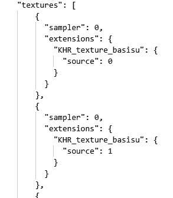

## Converting Between .glTF and .GLB Formats

To compress with KTX, it’s easiest to work with a binary GLB file since all the textures are contained in one asset. This isn’t strictly necessary, but it does make processing easier.

You can use [glTF Pipeline](https://github.com/CesiumGS/gltf-pipeline) to convert from a glTF with external binaries (BIN and textures) into a single GLB.

1. Open the OS command prompt (or PowerShell in Windows).

1. Because you installed Node.js earlier, you can now easily install glTF Pipeline:
```
npm install -g gltf-pipeline
```
3. Convert a glTF into a GLB:
```
gltf-pipeline -i input.gltf -b
```

This is a lossless conversion. The glTF assets (JSON, .bin, and images) are simply packed into a single binary GLB file. Note that the GLB is not necessarily a smaller file than the sum of the separate glTF/bin/image files, because the separate files are already compressed.

You may additionally apply [Draco mesh compression](https://github.com/google/draco) using glTF Pipeline, however this is generally a lossy operation, so it should be done as a final step after KTX conversion.

## Compression Examples

### StainedGlassLamp

This [stained glass lamp model](https://github.com/KhronosGroup/glTF-Sample-Models/pull/292) from Wayfair uses JPG and PNG textures. The overall file size is about 13 MB, but it increases to 96 MB in GPU memory because the textures must be uncompressed to use them for rendering.


The artifacts on the lamp are nearly imperceptible, but the savings are drastic. Compressing the textures with KTX reduces the file size to 10 MB, and it becomes 21 MB in GPU memory. That's about 81% of the file size and just 22% of the GPU size!

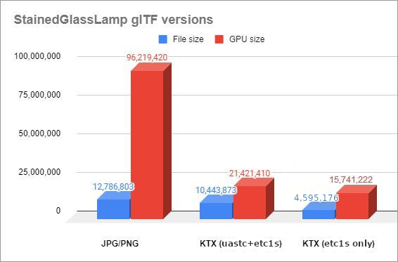

The textures were compressed from PNG source files using [toktx](https://github.com/KhronosGroup/KTX-Software#readme) via a combination of compression settings that favored high quality. UASTC was used for packed textures (ORM, Normal, etc.) and ETCS1 for Base Color and Emissive textures, however exceptions were made based on analyzing results... the `glass_basecolor-alpha` and `glass_emissive` textures were changed from ETC1S to UASTC since these were prominently displayed on the model and contained a lot of color variation.

toktx compression settings:
```
set mipmap=--genmipmap
set uastc=--uastc 4 --uastc_rdo_l .5 --uastc_rdo_d 65536 --zcmp 22
set uastchq=--uastc 4 --uastc_rdo_l .25 --uastc_rdo_d 65536 --zcmp 22
set etcs1=--bcmp --clevel 4 --qlevel 255
toktx %mipmap% %etcs1% StainedGlassLamp_base_basecolor.ktx2 StainedGlassLamp_base_basecolor.png
toktx %mipmap% %etcs1% StainedGlassLamp_base_emissive.ktx2 StainedGlassLamp_base_emissive.png
toktx %mipmap% %uastc% StainedGlassLamp_glass_basecolor-alpha.ktx2 StainedGlassLamp_glass_basecolor-alpha.png
toktx %mipmap% %uastc% StainedGlassLamp_glass_emissive.ktx2 StainedGlassLamp_glass_emissive.png
toktx %mipmap% %etcs1% StainedGlassLamp_grill_basecolor-alpha.ktx2 StainedGlassLamp_grill_basecolor-alpha.png
toktx %mipmap% %etcs1% StainedGlassLamp_grill_emissive.ktx2 StainedGlassLamp_grill_emissive.png
toktx %mipmap% %etcs1% StainedGlassLamp_hardware_basecolor.ktx2 StainedGlassLamp_hardware_basecolor.png
toktx %mipmap% %etcs1% StainedGlassLamp_hardware_emissive.ktx2 StainedGlassLamp_hardware_emissive.png
toktx %mipmap% %uastchq% --assign_oetf linear --assign_primaries none StainedGlassLamp_base_normal.ktx2 StainedGlassLamp_base_normal.png
toktx %mipmap% %uastchq% --assign_oetf linear --assign_primaries none StainedGlassLamp_base_occlusion-rough-metal.ktx2 StainedGlassLamp_base_occlusion-rough-metal.png
toktx %mipmap% %uastc% --assign_oetf linear --assign_primaries none StainedGlassLamp_bulbs_occlusion-rough-metal.ktx2 StainedGlassLamp_bulbs_occlusion-rough-metal.png
toktx %mipmap% %uastchq% --assign_oetf linear --assign_primaries none StainedGlassLamp_glass_normal.ktx2 StainedGlassLamp_glass_normal.png
toktx %mipmap% %uastc% --assign_oetf linear --assign_primaries none StainedGlassLamp_glass_occlusion-rough-metal_transmission.ktx2 StainedGlassLamp_glass_occlusion-rough-metal_transmission.png
toktx %mipmap% %uastc% --assign_oetf linear --assign_primaries none StainedGlassLamp_glass_transmission-clearcoat.ktx2 StainedGlassLamp_glass_transmission-clearcoat.png
toktx %mipmap% %uastchq% --assign_oetf linear --assign_primaries none StainedGlassLamp_grill_normal.ktx2 StainedGlassLamp_grill_normal.png
toktx %mipmap% %uastc% --assign_oetf linear --assign_primaries none StainedGlassLamp_grill_occlusion-rough-metal.ktx2 StainedGlassLamp_grill_occlusion-rough-metal.png
toktx %mipmap% %uastchq% --assign_oetf linear --assign_primaries none StainedGlassLamp_hardware_normal.ktx2 StainedGlassLamp_hardware_normal.png
toktx %mipmap% %uastc% --assign_oetf linear --assign_primaries none StainedGlassLamp_hardware_occlusion-rough-metal.ktx2 StainedGlassLamp_hardware_occlusion-rough-metal.png
toktx %mipmap% %uastc% --assign_oetf linear --assign_primaries none StainedGlassLamp_steel_occlusion-rough-metal.ktx2 StainedGlassLamp_steel_occlusion-rough-metal.png
```

### Duck

The [Duck](https://github.com/KhronosGroup/glTF-Sample-Models/tree/master/2.0/Duck) from Sony uses a single 512x512 PNG texture. The mostly-solid color values make it a great candidate for ETC1S compression because it causes few block compression artifacts. It saves only about 2% in file size, but saves about 82% in GPU memory.


Left: PNG texture, file size 118 KB, GPU size 1.5 MB. Right: KTX texture, file size 116 KB, GPU size 277 KB.


The duck texture was compressed with glTF-Transform using this command:

```
gltf-transform etc1s duck.gltf duck.gltf --verbose
```

## KTX Tips and Tricks

* Make sure to evaluate the quality and performance of uncompressed textures in actual scenes before applying compression; you may not need compression at all!
* If you can use a numerical value instead of a texture, that’s one less texture you have to compress! For example, if the Base Color on your model is a single color then it’s better to use a baseColorFactor (four numbers) instead of a baseColorTexture (a texture file).
* The [3D Commerce Asset Creation Guidelines](https://github.com/KhronosGroup/3DC-Asset-Creation/blob/main/asset-creation-guidelines/RealtimeAssetCreationGuidelines.md) have important information about how to create well-formed models.
* Before compression, textures should be stored as 8 bit per channel RGB or RGBA.
* KTX compression will preserve the best visual quality when starting with high quality source files. Start with textures in PNG format if possible. The lossy compression in JPEG textures should be avoided as it may cause additional artifacts in the end result. KTX is going to amplify those errors, causing more blocky artifacts or more blurry results.
* Power-of-two dimensions are almost always required for glTF textures: 2048, 1024, 512, etc. glTF-Transform has a --power-of-two flag to do the resizing for you, but starting with the intended size is better. Even when targeting newer platforms that support non-power-of-two texture dimensions, the texture dimensions still must be multiples of 4 to work with KHR_texture_basisu.
* Texture resolution should be appropriate for your delivery target, usually no larger than 2048x2048. Sometimes an Occlusion/Roughness/Metalness (ORM) texture has less detail than the Base Color texture, so it can be 1/4 the resolution of the Base Color… if a Base Color texture is 1024x1024, the ORM could be 512x512 and still look great on the model.
* Conversely, in some cases it may actually be useful to increase the resolution of the texture, to minimize compression artifacts while still retaining a smaller file size. To do this, double the dimensions (e.g. 512x512 to 1024x1024) without interpolation, before compressing them, then compare the results.
* Dimensions of lower mips must follow the usual mip-mapping rule - truncating division by 2 but always greater than zero. For example, the base level of 20x12 would have the following mip levels: 10x6, 5x3, 2x1, 1x1. Content pipeline tools could either prepare mip levels themselves or rely on KTX-Software to create downscaled textures during compression.
* For best results when authoring new textures, use texture dilation and minimize prominent UV seams.
* Whenever possible, align the UVs along a 4x4 pixel grid. KTX compression schemes compress the image in blocks, each of which is 4x4 pixels. When a smooth feature in a texture crosses the 4x4 border, it may suddenly get very choppy. You’ll see less compression artifacts whenever you can avoid crossing these 4x4 blocks.
* Textures with drastically different values in each of the color channels (R,G,B) will often cause more artifacts than those with similar values. Photos for example typically have similar values, whereas normal maps usually have a lot of variation from channel to channel. Because of this, photo-based textures can often be compressed more, while showing fewer artifacts. Consider using less aggressive compression settings for occlusion/roughness/metalness maps or normal maps than for other texture types: you may want to use UASTC instead, or PNG if file size is a concern.
