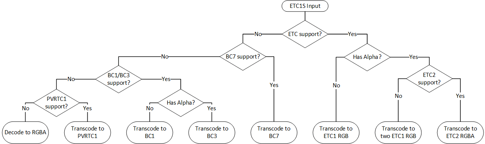
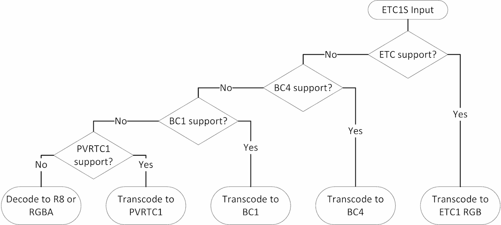
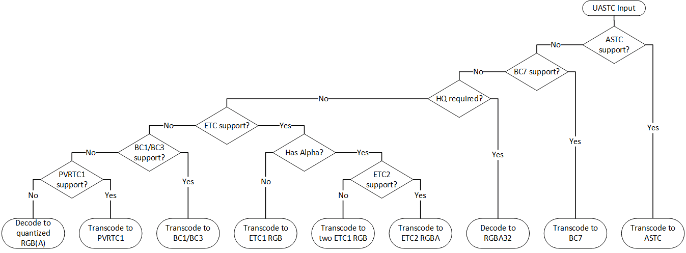
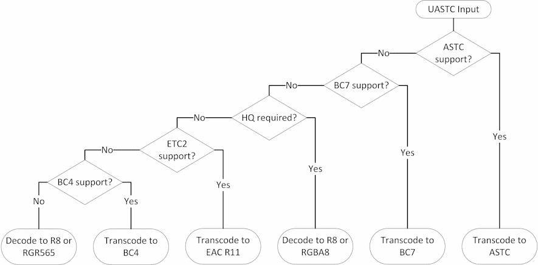

# KTX 2.0 / Basis Universal Textures — Developer Guide

## Contents

- [KTX Container Format](#ktx-container-format)
- [Block-based Compression](#block-based-compression)
- [ETC1S / BasisLZ Codec](#etc1s--basislz-codec)
  - [Overview](#overview)
  - [Data Layout](#data-layout)
  - [Runtime usage](#runtime-usage)
  - [Transcode Target Selection (RGB and RGBA)](#transcode-target-selection-rgb-and-rgba)
  - [Transcode Target Selection (Red)](#transcode-target-selection-red)
  - [Transcode Target Selection (Red-Green)](#transcode-target-selection-red-green)
- [UASTC Codec](#uastc-codec)
  - [Overview](#overview-1)
  - [Data Layout](#data-layout-1)
  - [Runtime usage](#runtime-usage-1)
  - [Primary Transcode Targets](#primary-transcode-targets)
  - [Additional Transcode Targets (RGB and RGBA)](#additional-transcode-targets-rgb-and-rgba)
  - [Additional Transcode Targets (Red)](#additional-transcode-targets-red)
  - [Additional Transcode Targets (Red-Green)](#additional-transcode-targets-red-green)
- [GPU API Support](#gpu-api-support)

## KTX Container Format

When implementing support for compressed textures, developers should be aware of three conceptual formats:

1. **Container format:** An explanatory wrapper around the transmission format data. Describes image dimensions, compression types, and how to access and transcode that data into a GPU-compatible pixel format. Without a container format, compressed data cannot be correctly moved between software applications.
  - _Examples: KTX 2.0_
2. **Transmission format:** A highly compressed representation of pixel data, in a layout designed for very efficient transcoding to one or more GPU compression formats.
  - _Examples: ETC1S and UASTC_
3. **GPU compressed pixel format:** A compressed representation of pixel data, understood by the GPU.
  - _Examples: BCn, ASTC, ETC, and PVRTC1_

 Portable [glTF 2.0](https://github.com/KhronosGroup/glTF) 3D assets may use compressed textures stored in the [KTX 2.0 Container Format](https://github.khronos.org/KTX-Specification/) (`.ktx2`), as described by the [`KHR_texture_basisu`](https://github.com/KhronosGroup/glTF/tree/master/extensions/2.0/Khronos/KHR_texture_basisu) glTF extension. KTX 2.0 is a relatively simple binary data format, and can be read or written without the use of existing software by referencing the format specification. Several existing implementations are available:

- [KTX-Software](https://github.com/KhronosGroup/KTX-Software/): Official C/C++ libraries for reading, writing, and transcoding KTX files, with optional functionality for instantiating textures in various graphics APIs. Includes [downloadable binary packages](https://github.com/KhronosGroup/KTX-Software/releases) and WebAssembly builds.
- [Basis Universal](https://github.com/BinomialLLC/basis_universal/): Binomial C/C++ libraries for writing and transcoding KTX files with BasisU texture formats. Includes WebAssembly builds.
- [KTX-Parse](https://github.com/donmccurdy/KTX-Parse): Lightweight JavaScript/TypeScript/Node.js library for reading and writing KTX files. Transcoding to a GPU compressed format must be handled separately<sup>1</sup>.

<small><sub><sup>1</sup> Transcoders from Basis Universal transmission formats to GPU compression formats are included in [KTX-Software](https://github.com/KhronosGroup/KTX-Software/), and available independently in [Binomial C/C++/WASM transcoders](https://github.com/BinomialLLC/basis_universal/) or [Khronos Group WASM transcoders](https://github.com/KhronosGroup/Basis-Universal-Transcoders).
</sub></small>

## Block-based Compression

To support random access, compressed textures are usually organized in blocks of the same size. Basis Universal always uses blocks of 4 by 4 pixels.

To calculate the number of blocks for a given texture (e.g. to estimate required GPU memory), applications should use the following expressions:
```
WIDTH_IN_BLOCKS = (WIDTH_IN_PIXELS + 3) >> 2;
HEIGHT_IN_BLOCKS = (HEIGHT_IN_PIXELS + 3) >> 2;

BLOCK_COUNT = WIDTH_IN_BLOCKS * HEIGHT_IN_BLOCKS;
```

Applications should expect that dimensions of a base mip level are 1, 2, or multiples of 4. Inputs that do not follow this restriction are invalid and should be rejected.

The dimensions of subsequent mip levels follow the regular rule of truncating division by 2. For example,

| Mip Level | Width x Height, px | Width x Height, blocks |
|:-:|-:|-:|
| 0 | 100 x 200 | 25 x 50 |
| 1 | 50 x 100 | 13 x 25 |
| 2 | 25 x 50 | 7 x 13 |
| 3 | 12 x 25 | 3 x 7 |
| 4 | 6 x 12 | 2 x 3 |
| 5 | 3 x 6 | 1 x 2 |
| 6 | 1 x 3 | 1 x 1 |
| 7 | 1 x 1 | 1 x 1 |

Here, the base mip level fully fills `25 x 50` compressed blocks. The following levels have some padding to fill the unused pixels in the compressed blocks. Such padding (when present) does not affect texture coordinates wrapping and cannot be accessed during sampling.

Some older platforms (e.g. WebGL 1.0) may require all textures to have power-of-2 dimensions. In such a case, applications have no other choice but to decompress and rescale textures that do not have power-of-2 dimensions thus losing all benefits of GPU texture compression.

## ETC1S / BasisLZ Codec

### Overview

ETC1S / BasisLZ is a hybrid compression scheme that features rearranged ETC1S texture block data with a custom LZ-style lossless compression. It achieves very high storage / transmission efficiency by prioritizing luma information. Thus, this codec is more suited for color textures (albedo, base color, etc) rather than arbitrary non-color data like normal maps.

After decoding LZ compression, ETC1S data could be losslessly repacked as regular ETC1 texture blocks or transcoded to other GPU block-compressed formats.

### Data Layout

ETC1S represents a subset of ETC1 so compressed data always has three color channels internally. To support use cases other than opaque color textures, compressed data may contain an extra ETC1S "slice".

The ETC1S Data Format Descriptor in KTX v2 container format may have one or two `channelType` entries.

Supported configurations include:

| Channels | First Slice | Second Slice | Typical Usage |
|-|-|-|-|
| RGB | `KHR_DF_CHANNEL_ETC1S_RGB` | Not present | Opaque color texture |
| RGBA | `KHR_DF_CHANNEL_ETC1S_RGB` | `KHR_DF_CHANNEL_ETC1S_AAA` | Color texture with alpha channel |
| Red | `KHR_DF_CHANNEL_ETC1S_RRR` | Not Present | Single-channel texture |
| Red-Green | `KHR_DF_CHANNEL_ETC1S_RRR` | `KHR_DF_CHANNEL_ETC1S_GGG` | Dual-channel texture |

### Runtime usage

Using ETC1S / BasisLZ data comprises three steps:

1. Initializing the transcoder with data common to all texture slices (i.e. faces, array elements, mip levels, etc).
   > **Note**: In KTX v2 container, such data is stored in `supercompressionGlobalData` block. See [BasisLZ Global Data](https://github.khronos.org/KTX-Specification/#basislz_gd) and [BasisLZ Bitstream Specification](https://github.khronos.org/KTX-Specification/#basisLZ) sections for more details.

2. Calling the decoder with per-slice data and the target texture format needed. Applications should choose target format depending on platform capabilities and expected usage.

3. Uploading transcoded data to the GPU.

   When the texture data uses non-linear sRGB encoding (virtually all color textures do that), applications should use hardware sRGB decoders to get correct filtering. This could be easily achieved by uploading compressed data with proper texture format enum, see specific values below.

   > **Note:** Single-channel (Red) and dual-channel (Red-Green) textures do not support sRGB encoding.

### Transcode Target Selection (RGB and RGBA)

- By design, ETC1S is a strict subset of ETC1 so transcoding it to ETC formats is always preferred. Single-slice textures should be transcoded to [ETC1 RGB](#etc1-rgb) while dual-slice textures should be transcoded to [ETC2 RGBA](#etc2-rgba).
  > **Note:** ETC1 RGB is a strict subset of ETC2 RGB.

  > **Note**: On platforms that support only ETC1, applications could transcode each ETC1S slice to its own ETC1 texture and use two texture samplers simultaneously.

- On desktop GPUs without ETC support, applications should transcode to [BC7](#bc7).
  > **Note:** BC7 always supports alpha channel. For opaque (single-slice) ETC1S inputs, the reference transcoder produces BC7 blocks with alpha values set to `255`.

- On older desktops without BC7 support, RGB (single-slice) textures should be transcoded to [BC1](#bc1-s3tc-rgb), while RGBA (dual-slice) textures should be transcoded to [BC3](#bc3-s3tc-rgba).

- Transcoding to [PVRTC1](#pvrtc1-1) is also supported but should be used only if other options are not available.
  > **Note:** Transcoding to PVRTC1 is supported only for textures that have power-of-two dimensions.

  > **Note:** Apple platforms may reject non-square PVRTC1 textures.

- In an unfortunate situation where the platform supports none of aforementioned compressed texture formats, ETC1S data could be decoded to [uncompressed RGBA](#uncompressed-formats).



### Transcode Target Selection (Red)

- As with RGB data, [ETC1 RGB](#etc1-rgb) is the most preferred option as it provides lossless transcoding.
  > **Note**: Green and blue channels will have the same value as red during sampling.

  > **Note**: [EAC R11](#eac-r11) may be used when sampling from semantically unused channels (Green and Blue) is required to return zeros and texture swizzling is not supported.

- On desktop GPUs without ETC1 support, applications should transcode to [BC4](#bc4).
  > **Note**: Green and blue channels will return zeros during sampling.

- On very old desktops without BC4 support, applications should transcode to [BC1](#bc1-s3tc-rgb).
  > **Note**: Blue channel will have the same value as red during sampling. Green channel will have a slightly different value because BC1 uses more quantization bits for it.

- Transcoding to [PVRTC1](#pvrtc1-1) should be used only if other options are not available.
  > **Note:** Transcoding to PVRTC1 is supported only for textures that have power-of-two dimensions.

  > **Note:** Apple platforms may reject non-square PVRTC1 textures.

  > **Note**: Green and blue channels will have the same value as red during sampling.

- As a last resort, ETC1S data could be decoded to uncompressed [R8](#r8) or [RGBA8](#rgba8) pixels.



### Transcode Target Selection (Red-Green)

- Since Red-Green ETC1S textures contain two independently-encoded slices, [EAC RG11](#eac-rg11) is the most preferred option.
  > **Note**: Blue channel will return zero during sampling.

  > **Note**: On platforms that support only ETC1 RGB, applications could transcode each ETC1S slice to its own ETC1 RGB texture and use two texture samplers simultaneously.

- On desktop GPUs without EAC RG11 support, applications should transcode both slices to a single [BC5](#bc5) texture.
  > **Note**: Blue channel will return zero during sampling.

- As a last resort, ETC1S data could be decoded to uncompressed [RG8](#rg8) or [RGBA8](#rgba8) pixels.


## UASTC Codec

### Overview

UASTC is a virtual block-compressed texture format that is designed for quick and efficient transcoding (i.e. conversion) to hardware-supported block-compressed GPU formats. Being built on top of state of the art ASTC and BC7 texture compression techniques, it can handle all kinds of 8-bit texture data: color maps, normal maps, height maps, etc. By applying RDO (rate-distortion optimization) during encoding, UASTC output can be optimized for subsequent LZ-style lossless compression for more efficient transmission and storage. KTX v2 container format relies on Zstandard for lossless compression.

### Data Layout

UASTC blocks may have from 2 to 4 color channels internally. The encoder chooses different block modes depending on the texture contents. In all cases, only one "slice" of UASTC data is used.

The UASTC Data Format Descriptor in KTX v2 container format has only one `channelType` entry.

Supported configurations include:

| Channels | `channelType` | Typical Usage |
|-|-|-|
| RGB | `KHR_DF_CHANNEL_UASTC_RGB` | Opaque color texture |
| RGBA | `KHR_DF_CHANNEL_UASTC_RGBA` | Color texture with alpha channel |
| Red | `KHR_DF_CHANNEL_UASTC_RRR` | Single-channel texture |
| Red-Green | `KHR_DF_CHANNEL_UASTC_RG` | Dual-channel texture |

### Runtime usage

UASTC textures consist of 4x4 blocks, each block takes exactly 16 bytes. Zstandard compression (when present) must be decoded prior to texture transcoding.

Since UASTC is a "virtual" texture format, it has to be converted to one of hardware-supported formats prior to GPU uploading. Applications should choose target format depending on platform capabilities and expected usage.

When the texture data uses non-linear sRGB encoding (virtually all color textures do that), applications should use hardware sRGB decoders to get correct filtering. This could be easily achieved by uploading compressed data with proper texture format enum, see specific values below.

### Primary Transcode Targets

By design, UASTC is optimized for fast and predictable transcoding to ASTC and BC7. Transcoding to ASTC is always lossless (e.g. it would match decoding to RGBA8), transcoding to BC7 is almost lossless.

[ASTC 4x4](#astc-4x4) should be the default choice when ASTC LDR support is available.

> **Note**: At the time of writing, GPUs supporting ASTC LDR include:
> * Apple A8 and newer, Apple M1
> * Arm Mali-T620 and newer
> * ImgTec PowerVR Series6 and newer
> * Intel Gen9 ("Skylake") and newer
> * NVIDIA Tegra
> * Qualcomm Adreno 3xx series and newer

[BC7](#bc7) should be the default choice when BC7 is supported but ASTC is not. Such platforms include most desktop GPUs.

When a high-quality output is required (e.g. for normal or other non-color maps) but neither ASTC nor BC7 are supported, UASTC data should be decoded to uncompressed [RGBA8](#rgba8) values.
> **Note**: Even when the texture is known to be opaque, it's still usually better to upload it as RGBA8 instead of RGB8 due to GPU memory alignment.

Besides RGB and RGBA texture types, UASTC codec may be used for encoding Red and Red-Green textures since it provides better quality than ETC1S. ASTC and BC7 still remain the primary transcode targets while uncompressed [R8](#r8) and [RG8](#rg8) formats are the high-quality fallback options.

> **Note**: Even when a UASTC texture is known to be of Red or Red-Green type, unused channels may contain non-zero values after transcoding. Applications should sample only from the used channels.

### Additional Transcode Targets (RGB and RGBA)

Although transcoding to the following formats may result in some quality loss, it can sometimes be a better choice than decoding to uncompressed considering reduced GPU memory footprint. Usually, the loss is acceptable for textures containing color data.



#### ETC

Transcoding UASTC to ETC involves decoding the texture to uncompressed pixels and re-encoding them as ETC. This process is fully implemented by the reference transcoder and partly accelerated by ETC-specific hints that are present in UASTC data.

Opaque UASTC textures should be transcoded to and uploaded as [ETC1 RGB](#etc1-rgb).

UASTC textures with alpha channel should be transcoded to and uploaded as [ETC2 RGBA](#etc2-rgba).

#### S3TC (BC1 / BC3)

Transcoding UASTC to S3TC (aka DXT) formats involves decoding the texture to uncompressed pixels and re-encoding them as [BC1](#bc1-s3tc-rgb) or [BC3](#bc3-s3tc-rgba). This process is fully implemented by the reference transcoder. Transcoding of RGB data could be partly accelerated by BC1-specific hints that may be present in UASTC data.

Opaque UASTC textures should be transcoded to and uploaded as [BC1](#bc1-s3tc-rgb).

UASTC textures with alpha channel should be transcoded to and uploaded as [BC3](#bc3-s3tc-rgba).

#### PVRTC1

Transcoding to UASTC to PVRTC1 involves decoding the texture to uncompressed pixels and re-encoding them as PVRTC1. This process is fully implemented by the reference transcoder.

> **Note:** Transcoding to PVRTC1 is supported only for textures that have power-of-two dimensions.

> **Note**: The reference UASTC to PVRTC1 transcoder needs to know whether the alpha channel is used.

> **Note**: Apple hardware may reject non-square PVRTC1 textures.

#### 16-bit packed formats

Sometimes, decoding UASTC to [16-bit packed pixel formats](#16-bit-packed-formats-1) (RGB565 or RGBA4444) may yield better results than transcoding to ETC, BC1/BC3, or PVRTC1 at a cost of increased (about 2x) GPU memory footprint.

### Additional Transcode Targets (Red)

When both ASTC and BC7 are not available, Red (single-channel) UASTC textures may be transcoded to [EAC R11](#eac-r11) or [BC4](#bc4). Both of these targets would use less GPU memory at runtime than uncompressed [R8](#r8). Transcoding to them involves decoding UASTC and re-encoding so it may be slower than using the decoded data as-is. Unless the texture contains high-contrast high-frequency data, the transcoding quality loss is usually negligible.



### Additional Transcode Targets (Red-Green)

When both ASTC and BC7 are not available, Red-Green (dual-channel) UASTC textures may be transcoded to [EAC RG11](#eac-rg11) or [BC5](#bc5). Both of these targets would use less GPU memory at runtime than uncompressed [RG8](#rg8). Transcoding to them involves decoding UASTC and re-encoding so it may be slower than using the decoded data as-is. Unless the texture contains high-contrast high-frequency data, the transcoding quality loss is usually negligible.


## GPU API Support

### Compressed Formats

#### ASTC 4x4

The transcoded data uses 16 bytes per each 4x4 block.

| API | Feature Detection | sRGB Format Enum | Linear Format Enum |
|-|-|-|-|
| Vulkan | `textureCompressionASTC_LDR` device feature | `VK_FORMAT_ASTC_4x4_SRGB_BLOCK` | `VK_FORMAT_ASTC_4x4_UNORM_BLOCK` |
| WebGL | `WEBGL_compressed_texture_astc` extension | `COMPRESSED_SRGB8_ALPHA8_ASTC_4x4_KHR` | `COMPRESSED_RGBA_ASTC_4x4_KHR` |
| OpenGL (ES) | `GL_KHR_texture_compression_astc_ldr` extension | `GL_COMPRESSED_SRGB8_ALPHA8_ASTC_4x4_KHR` | `GL_COMPRESSED_RGBA_ASTC_4x4_KHR` |
| Direct3D | N/A | N/A | N/A |
| Metal | `MTLGPUFamilyApple2`-compatible GPU | `MTLPixelFormatASTC_4x4_sRGB` | `MTLPixelFormatASTC_4x4_LDR` |

When the platform supports setting ASTC decode mode (e.g. via `VK_EXT_astc_decode_mode` or `GL_EXT_texture_compression_astc_decode_mode`), applications should set it to `unorm8`.

#### BC1 (S3TC RGB)

The transcoded data uses 8 bytes per each 4x4 block.

| API | Feature Detection | sRGB Format | Linear Format |
|-|-|-|-|
| Vulkan | `textureCompressionBC` device feature | `VK_FORMAT_BC1_RGB_SRGB_BLOCK` | `VK_FORMAT_BC1_RGB_UNORM_BLOCK` |
| WebGL | `WEBGL_compressed_texture_s3tc` and `WEBGL_compressed_texture_s3tc_srgb` extensions | `COMPRESSED_SRGB_S3TC_DXT1_EXT` | `COMPRESSED_RGB_S3TC_DXT1_EXT` |
| OpenGL | `GL_EXT_texture_compression_s3tc` and `GL_EXT_texture_sRGB` extensions | `GL_COMPRESSED_SRGB_S3TC_DXT1_EXT` | `GL_COMPRESSED_RGB_S3TC_DXT1_EXT` |
| OpenGL ES | `GL_EXT_texture_compression_s3tc` and `GL_EXT_texture_compression_s3tc_srgb` extensions | `GL_COMPRESSED_SRGB_S3TC_DXT1_EXT` | `GL_COMPRESSED_RGB_S3TC_DXT1_EXT` |
| Direct3D | `9_1` feature level or higher | `DXGI_FORMAT_BC1_UNORM_SRGB` | `DXGI_FORMAT_BC1_UNORM` |
| Metal | `MTLGPUFamilyMac1` or `MTLGPUFamilyMacCatalyst1`-compatible GPU | `MTLPixelFormatBC1_RGBA_sRGB` | `MTLPixelFormatBC1_RGBA` |

> **Note**: For Direct3D and Metal, BC1 RGBA enums are used since these APIs do not expose BC1 RGB. Transcoded blocks produced by the reference transcoder will be sampled correctly anyway.

#### BC3 (S3TC RGBA)

The transcoded data uses 16 bytes per each 4x4 block.

| API | Feature Detection | sRGB Format | Linear Format |
|-|-|-|-|
| Vulkan | `textureCompressionBC` device feature | `VK_FORMAT_BC3_SRGB_BLOCK` | `VK_FORMAT_BC3_UNORM_BLOCK` |
| WebGL | `WEBGL_compressed_texture_s3tc` and `WEBGL_compressed_texture_s3tc_srgb` extensions | `COMPRESSED_SRGB_ALPHA_S3TC_DXT5_EXT` | `COMPRESSED_RGBA_S3TC_DXT5_EXT` |
| OpenGL | `GL_EXT_texture_compression_s3tc` and `GL_EXT_texture_sRGB` extensions | `GL_COMPRESSED_SRGB_ALPHA_S3TC_DXT5_EXT` | `GL_COMPRESSED_RGBA_S3TC_DXT5_EXT` |
| OpenGL ES | `GL_EXT_texture_compression_s3tc` and `GL_EXT_texture_compression_s3tc_srgb` extensions | `GL_COMPRESSED_SRGB_ALPHA_S3TC_DXT5_EXT` | `GL_COMPRESSED_RGBA_S3TC_DXT5_EXT` |
| Direct3D | `9_1` feature level or higher | `DXGI_FORMAT_BC3_UNORM_SRGB` | `DXGI_FORMAT_BC3_UNORM` |
| Metal | `MTLGPUFamilyMac1` or `MTLGPUFamilyMacCatalyst1`-compatible GPU | `MTLPixelFormatBC3_RGBA_sRGB` | `MTLPixelFormatBC3_RGBA` |

#### BC4

The transcoded data uses 8 bytes per each 4x4 block.

| API | Feature Detection | Linear Format |
|-|-|-|
| Vulkan | `textureCompressionBC` device feature | `VK_FORMAT_BC4_UNORM_BLOCK` |
| WebGL | `EXT_texture_compression_rgtc` extension | `COMPRESSED_RED_RGTC1_EXT` |
| OpenGL | `ARB_texture_compression_rgtc` extension | `GL_COMPRESSED_RED_RGTC1_EXT` |
| OpenGL ES | `GL_EXT_texture_compression_rgtc` extension | `GL_COMPRESSED_RED_RGTC1_EXT` |
| Direct3D | `10_0` feature level or higher | `DXGI_FORMAT_BC4_UNORM` |
| Metal | `MTLGPUFamilyMac1` or `MTLGPUFamilyMacCatalyst1`-compatible GPU | `MTLPixelFormatBC4_RUnorm` |

#### BC5

The transcoded data uses 16 bytes per each 4x4 block.

| API | Feature Detection | Linear Format |
|-|-|-|
| Vulkan | `textureCompressionBC` device feature | `VK_FORMAT_BC5_UNORM_BLOCK` |
| WebGL | `EXT_texture_compression_rgtc` extension | `COMPRESSED_RED_GREEN_RGTC2_EXT` |
| OpenGL | `ARB_texture_compression_rgtc` extension | `GL_COMPRESSED_RED_GREEN_RGTC2_EXT` |
| OpenGL ES | `GL_EXT_texture_compression_rgtc` extension | `GL_COMPRESSED_RED_GREEN_RGTC2_EXT` |
| Direct3D | `10_0` feature level or higher | `DXGI_FORMAT_BC5_UNORM` |
| Metal | `MTLGPUFamilyMac1` or `MTLGPUFamilyMacCatalyst1`-compatible GPU | `MTLPixelFormatBC5_RGUnorm` |

#### BC7

The transcoded data uses 16 bytes per each 4x4 block.

| API | Feature Detection | sRGB Format | Linear Format |
|-|-|-|-|
| Vulkan | `textureCompressionBC` device feature | `VK_FORMAT_BC7_SRGB_BLOCK` | `VK_FORMAT_BC7_UNORM_BLOCK` |
| WebGL | `EXT_texture_compression_bptc` extension | `COMPRESSED_SRGB_ALPHA_BPTC_UNORM_EXT` | `COMPRESSED_RGBA_BPTC_UNORM_EXT` |
| OpenGL | `GL_ARB_texture_compression_bptc` extension | `GL_COMPRESSED_SRGB_ALPHA_BPTC_UNORM_ARB` | `GL_COMPRESSED_RGBA_BPTC_UNORM_ARB` |
| OpenGL ES | `GL_EXT_texture_compression_bptc` extension | `GL_COMPRESSED_SRGB_ALPHA_BPTC_UNORM_EXT` | `GL_COMPRESSED_RGBA_BPTC_UNORM_EXT` |
| Direct3D | `11_0` feature level | `DXGI_FORMAT_BC7_UNORM_SRGB` | `DXGI_FORMAT_BC7_UNORM` |
| Metal | `MTLGPUFamilyMac1` or `MTLGPUFamilyMacCatalyst1`-compatible GPU | `MTLPixelFormatBC7_RGBAUnorm_sRGB` | `MTLPixelFormatBC7_RGBAUnorm` |

#### ETC1 RGB

The transcoded data uses 8 bytes per each 4x4 block.

| API | Feature Detection | sRGB Format | Linear Format |
|-|-|-|-|
| Vulkan | `textureCompressionETC2` device feature | `VK_FORMAT_ETC2_R8G8B8_SRGB_BLOCK` | `VK_FORMAT_ETC2_R8G8B8_UNORM_BLOCK` |
| WebGL | `WEBGL_compressed_texture_etc` extension | `COMPRESSED_SRGB8_ETC2` | `COMPRESSED_RGB8_ETC2` |
| OpenGL | `GL_ARB_ES3_compatibility` extension | `GL_COMPRESSED_SRGB8_ETC2` | `GL_COMPRESSED_RGB8_ETC2` |
| OpenGL ES | Version 3.0 or higher | `GL_COMPRESSED_SRGB8_ETC2` | `GL_COMPRESSED_RGB8_ETC2` |
| Direct3D | N/A | N/A | N/A |
| Metal | `MTLGPUFamilyApple1`-compatible GPU | `MTLPixelFormatETC2_RGB8_sRGB` | `MTLPixelFormatETC2_RGB8` |

> **Note**: WebGL contexts backed by OpenGL ES 2.0 may support `WEBGL_compressed_texture_etc1` extension that exposes only linear ETC1 texture format (`ETC1_RGB8_OES`). Applications would need to decode sRGB values with a fragment shader.

> **Note**: OpenGL ES 2.0 contexts may support `GL_OES_compressed_ETC1_RGB8_texture` extension that exposes only linear ETC1 texture format (`GL_ETC1_RGB8_OES`). Applications would need to decode sRGB values with a fragment shader.

> **Note**: The reference transcoder implementation produces blocks that don't use ETC2-specific features thus making it possible to use transcoded data on ETC1 hardware.

> **Note**: Although many desktop GPUs expose `GL_ARB_ES3_compatibility` OpenGL extension, most of them do not have hardware support for ETC1 RGB format and decompress it in the driver instead. At the time of writing, only Intel desktop GPUs newer than "Haswell" support this format natively.

#### ETC2 RGBA

The transcoded data uses 16 bytes per each 4x4 block.

| API | Feature Detection | sRGB Format | Linear Format |
|-|-|-|-|
| Vulkan | `textureCompressionETC2` device feature | `VK_FORMAT_ETC2_R8G8B8A8_SRGB_BLOCK` | `VK_FORMAT_ETC2_R8G8B8A8_UNORM_BLOCK` |
| WebGL | `WEBGL_compressed_texture_etc` extension | `COMPRESSED_SRGB8_ALPHA8_ETC2_EAC` | `COMPRESSED_RGBA8_ETC2_EAC` |
| OpenGL | `GL_ARB_ES3_compatibility` extension | `GL_COMPRESSED_SRGB8_ALPHA8_ETC2_EAC` | `GL_COMPRESSED_RGBA8_ETC2_EAC` |
| OpenGL ES | Version 3.0 or higher | `GL_COMPRESSED_SRGB8_ALPHA8_ETC2_EAC` | `GL_COMPRESSED_RGBA8_ETC2_EAC` |
| Direct3D | N/A | N/A | N/A |
| Metal | `MTLGPUFamilyApple1`-compatible GPU | `MTLPixelFormatEAC_RGBA8_sRGB` | `MTLPixelFormatEAC_RGBA8` |

> **Note**: Applications running on OpenGL ES 2.0 contexts or WebGL contexts backed by OpenGL ES 2.0 may transcode data to two ETC1 textures: one for RGB and another for alpha. Refer to the previous section for more notes on using ETC1 hardware.

> **Note**: Although many desktop GPUs expose `GL_ARB_ES3_compatibility` OpenGL extension, most of them do not have hardware support for ETC2 RGBA format and decompress it in the driver instead. At the time of writing, only Intel desktop GPUs newer than "Haswell" support this format natively.

#### EAC R11

The transcoded data uses 8 bytes per each 4x4 block.

| API | Feature Detection | Linear Format |
|-|-|-|
| Vulkan | `textureCompressionETC2` device feature | `VK_FORMAT_EAC_R11_UNORM_BLOCK` |
| WebGL | `WEBGL_compressed_texture_etc` extension | `COMPRESSED_R11_EAC` |
| OpenGL | `GL_ARB_ES3_compatibility` extension | `GL_COMPRESSED_R11_EAC` |
| OpenGL ES | Version 3.0 or higher | `GL_COMPRESSED_R11_EAC` |
| Direct3D | N/A | N/A |
| Metal | `MTLGPUFamilyApple1`-compatible GPU | `MTLPixelFormatEAC_R11Unorm` |

> **Note**: Although many desktop GPUs expose `GL_ARB_ES3_compatibility` OpenGL extension, most of them do not have hardware support for EAC R11 format and decompress it in the driver instead. At the time of writing, only Intel desktop GPUs newer than "Haswell" support this format natively.

#### EAC RG11

The transcoded data uses 16 bytes per each 4x4 block.

| API | Feature Detection | Linear Format |
|-|-|-|
| Vulkan | `textureCompressionETC2` device feature | `VK_FORMAT_EAC_R11G11_UNORM_BLOCK` |
| WebGL | `WEBGL_compressed_texture_etc` extension | `COMPRESSED_RG11_EAC` |
| OpenGL | `GL_ARB_ES3_compatibility` extension | `GL_COMPRESSED_RG11_EAC` |
| OpenGL ES | Version 3.0 or higher | `GL_COMPRESSED_RG11_EAC` |
| Direct3D | N/A | N/A |
| Metal | `MTLGPUFamilyApple1`-compatible GPU | `MTLPixelFormatEAC_RG11Unorm` |

> **Note**: Although many desktop GPUs expose `GL_ARB_ES3_compatibility` OpenGL extension, most of them do not have hardware support for EAC RG11 format and decompress it in the driver instead. At the time of writing, only Intel desktop GPUs newer than "Haswell" support this format natively.

#### PVRTC1

The transcoded data uses 8 bytes per each 4x4 block.

| API | Feature Detection | sRGB Format | Linear Format |
|-|-|-|-|
| Vulkan | `VK_IMG_format_pvrtc` extension | `VK_FORMAT_PVRTC1_4BPP_SRGB_BLOCK_IMG` | `VK_FORMAT_PVRTC1_4BPP_UNORM_BLOCK_IMG` |
| WebGL | `WEBGL_compressed_texture_pvrtc` extension | N/A | `COMPRESSED_RGBA_PVRTC_4BPPV1_IMG` |
| OpenGL | N/A | N/A | N/A |
| OpenGL ES | `GL_IMG_texture_compression_pvrtc` and `GL_EXT_pvrtc_sRGB` extensions | `GL_COMPRESSED_SRGB_ALPHA_PVRTC_4BPPV1_EXT` | `GL_COMPRESSED_RGBA_PVRTC_4BPPV1_IMG` |
| Direct3D | N/A | N/A | N/A |
| Metal | `MTLGPUFamilyApple1`-compatible GPU | `MTLPixelFormatPVRTC_RGBA_4BPP_sRGB` | `MTLPixelFormatPVRTC_RGBA_4BPP` |

> **Note**: WebGL contexts do not support sRGB PVRTC1 formats. Applications would need to decode sRGB values with a fragment shader.

### Uncompressed Formats

#### RGBA8

The decoded data size must be computed from image dimensions in pixels (not blocks) as
```
width * height * 4
```

| API | sRGB Format | Linear Format |
|-|-|-|
| Vulkan | `VK_FORMAT_R8G8B8A8_SRGB` | `VK_FORMAT_R8G8B8A8_UNORM` |
| WebGL | `SRGB8_ALPHA8` | `RGBA8` |
| OpenGL (ES) | `GL_SRGB8_ALPHA8` | `GL_RGBA8` |
| Direct3D | `DXGI_FORMAT_R8G8B8A8_UNORM_SRGB` | `DXGI_FORMAT_R8G8B8A8_UNORM` |
| Metal | `MTLPixelFormatRGBA8Unorm_sRGB` | `MTLPixelFormatRGBA8Unorm` |

> **Note**: WebGL 1.0 contexts require `EXT_sRGB` extension to be enabled for sRGB filtering.

#### 16-bit packed formats

The decoded data size must be computed from image dimensions in pixels (not blocks) as
```
width * height * 2
```

| API | Feature Detection | RGB | RGBA |
|-|-|-|-|
| Vulkan | Always supported | `VK_FORMAT_R5G6B5_UNORM_PACK16` | `VK_FORMAT_R4G4B4A4_UNORM_PACK16` |
| WebGL | Always supported | `RGB565` | `RGBA4` |
| OpenGL (ES) | Always supported | `GL_RGB565` | `GL_RGBA4` |
| Direct3D | WDDM 1.2 or newer | `DXGI_FORMAT_B5G6R5_UNORM` | N/A |
| Metal | `MTLGPUFamilyApple1`-compatible GPU | `MTLPixelFormatB5G6R5Unorm` | `MTLPixelFormatABGR4Unorm` |

> **Note**: WebGL applications should be cautious with using these formats because they will be emulated as RGBA8 when the underlying platform does not support packed 16-bit formats natively.

> **Note**: There is no hardware sRGB decoding support for packed formats. Applications would need to decode sRGB values with a fragment shader.

#### R8

The decoded data size must be computed from image dimensions in pixels (not blocks) as
```
width * height * 1
```

| API | Linear Format |
|-|-|
| Vulkan | `VK_FORMAT_R8_UNORM` |
| WebGL 2.0 | `R8` |
| OpenGL (ES) | `GL_R8` |
| Direct3D | `DXGI_FORMAT_R8_UNORM` |
| Metal | `MTLPixelFormatR8Unorm` |

#### RG8

The decoded data size must be computed from image dimensions in pixels (not blocks) as
```
width * height * 2
```

| API | Linear Format |
|-|-|
| Vulkan | `VK_FORMAT_R8G8_UNORM` |
| WebGL 2.0 | `RG8` |
| OpenGL (ES) | `GL_RG8` |
| Direct3D | `DXGI_FORMAT_R8G8_UNORM` |
| Metal | `MTLPixelFormatRG8Unorm` |
