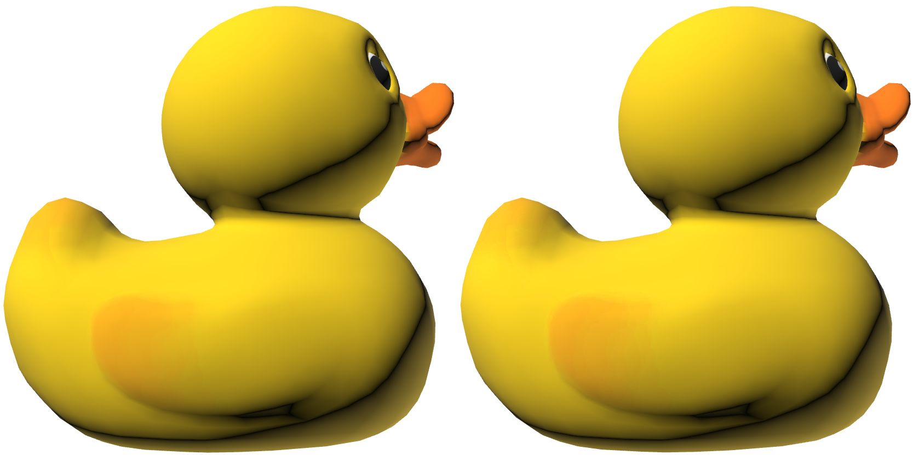
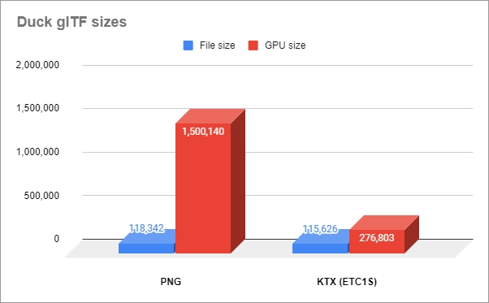

# Duck
## Screenshot

## KTX Compression

Textures with large areas of similar colors are good candidates for ETC1S compression which can dramatically decrease file and memory sizes. Although there are a few areas with soft gradients that tend to cause block artifacts with ETC1S, the colors remain very similar between the red and green channels so this example results in fewer ETC1S artifacts.

PNG left, KTX right, screenshots from the [glTF Sample Viewer](https://github.khronos.org/glTF-Sample-Viewer-Release/).

The texture was compressed with [glTF-Transform](https://github.com/donmccurdy/glTF-Transform) using the command `gltf-transform etc1s duck.gltf duck.gltf`

File sizes were extracted using `gltf-transform inspect duck.gltf --format csv >data.csv` which was then loaded into Google Sheets to compare data and create a chart. 

## License Information

Copyright 2006 Sony Computer Entertainment Inc.

Licensed under the SCEA Shared Source License, Version 1.0 (the "License"); you may not use this file except in compliance with the License. You may obtain a copy of the License at:

https://web.archive.org/web/20160320123355/http://research.scea.com/scea_shared_source_license.html

Unless required by applicable law or agreed to in writing, software distributed under the License is distributed on an "AS IS" BASIS, WITHOUT WARRANTIES OR CONDITIONS OF ANY KIND, either express or implied. See the License for the specific language governing permissions and limitations under the License.