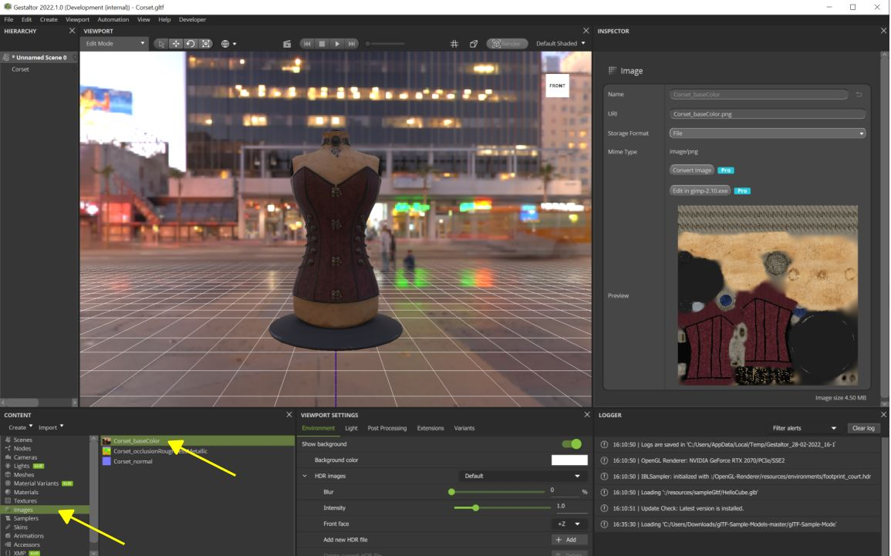
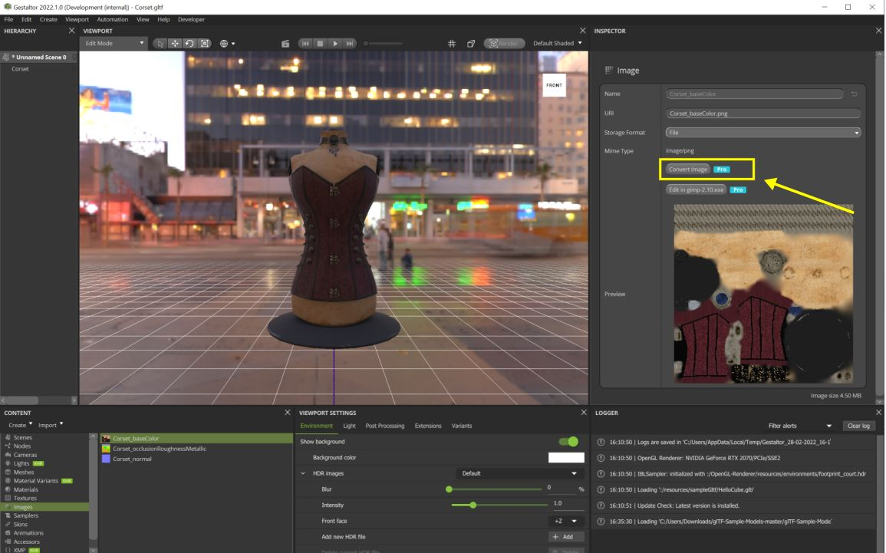
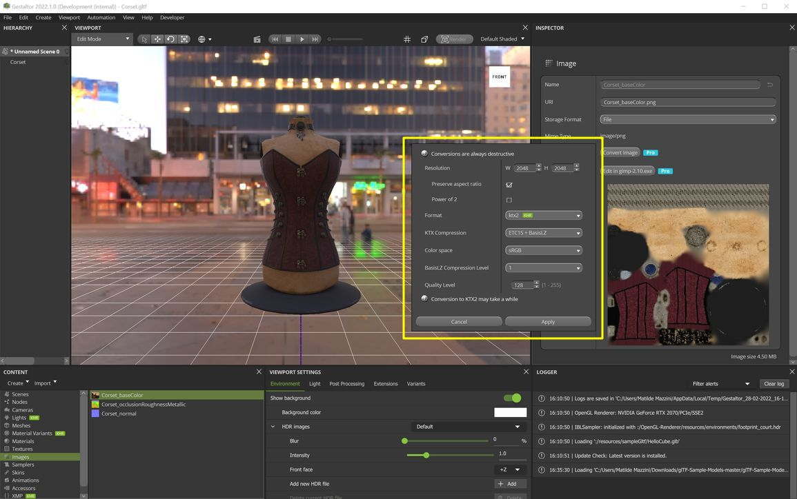

Previous: [KTX Guide for toktx](KTXArtistGuide_toktx.md) | Home: [KTX Artist Guide](../KTXArtistGuide.md) | Next: [KTX Guide for glTF-Compressor](KTXArtistGuide_glTF-Compressor.md)

---

## KTX Guide for Gestaltor

[Gestaltor](https://gestaltor.io/) is a visual glTF editor with KTX support. Useful for editing individual glTF files, or batch processing via the command line. Free for non-commercial use on glTF files under 2mb. Subscription removes all limits, and gives access to the command line. 

1. Install the app, via Steam, Linux, MacOS, or Windows. See [installation instructions](https://gestaltor.help/started/installation.html). 

2. Open a glTF via _File > Open…_ in the menu bar, for example the [Corset](https://github.com/KhronosGroup/glTF-Sample-Assets/tree/main/Models/Corset#corset).

3. In the _Content_ widget, open the Images section and choose one of the textures:

4. In the _Inspector_ widget, press _Convert image_:

5. Choose _ktx2_ as the format.  Choose the compression of choice and press _Apply_.

6. There is no progress bar; depending on the image and settings this can take some time. 

7. Save the finished asset via _File > Save_ in the menu bar.

> 📝 NOTE: 
> Gestaltor offers many additional tools beyond KTX compression: adjusting glTF assets, editing materials, adding extensions, etc.

---

Previous: [KTX Guide for toktx](KTXArtistGuide_toktx.md) | Home: [KTX Artist Guide](../KTXArtistGuide.md) | Next: [KTX Guide for glTF-Compressor](KTXArtistGuide_glTF-Compressor.md)
