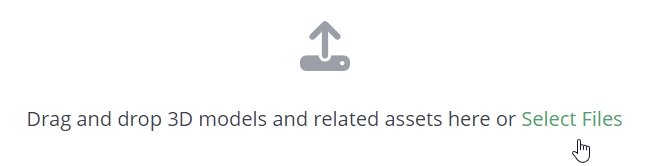
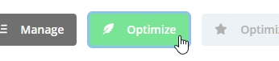
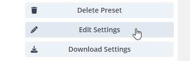
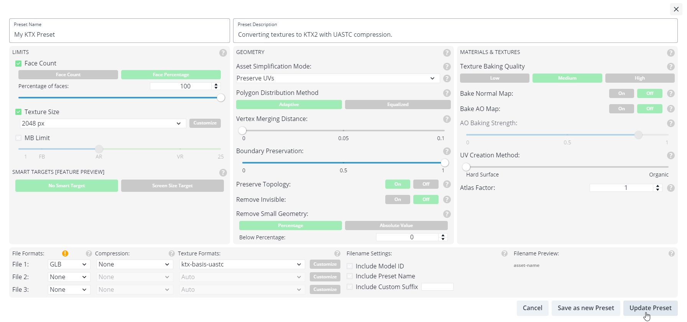
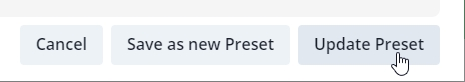
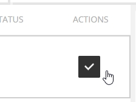
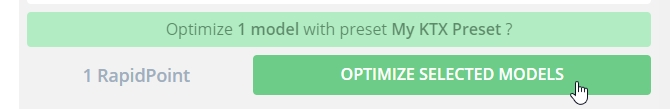
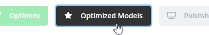
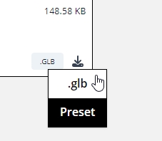

Previous: [KTX Guide for glTF-Transform](KTXArtistGuide_glTF-Transform.md) | Home: [KTX Artist Guide](../KTXArtistGuide.md) | Next: [KTX Guide for toktx](KTXArtistGuide_toktx.md)

---

## KTX Guide for RapidCompact

[RapidCompact](https://rapidcompact.com/) is an online platform for optimization of 3D data with KTX support. Free for non-commercial use. Useful for optimizing individual glTF files, or automating batches of files.

1. Sign Up to create an account, or Log In to an existing account.

    

2. Upload a model. For example, the Duck model https://github.com/KhronosGroup/glTF-Sample-Assets/blob/main/Models/Duck/glTF-Binary/Duck.glb

    

3. Go to the _Optimize_ tab to adjust conversion settings. 

    

4. Under the section _Optimization Settings_ choose _Custom_, click on the empty + button to start a new preset, and click on _Edit Settings_.

    

5. Because we are only converting textures to KTX and not simplifying the model, we will adjust some settings:

    * Percentage of Faces: 100
    * Texture Size: 512 px (your number here will vary, depending on your input file) 
    * File 1 Texture Formats: ktx-basis-uastc
    * File 2: None
    * File 3: None
    * Asset Simplificaiton Mode: Preserve UVs
    * Polygon Distribution Method: Adaptive
    * Vertex Merging Distance: 0
    * Boundary Preservation: 1
    * Preserve Topology: On
    * Remove Invisible: Off
    * Remove Small Geometry: Percentage
    * Below Percentage: 0
    * Bake Normal Map: Off

    

    > 📝 NOTE: 
    > RapidCompact offers many additional features beyond KTX compression: geometry processing, texture baking, UV remapping, and shader optimization. 

6. Press the _Update Preset_ button to save the settings.

    

7. Make sure at least one model is enabled in the _Actions_ column.

    

8. Press the button _OPTIMIZE SELECTED MODELS_.

    

9. Once complete, go to the _Optimized Models_ tab to download the converted model, and choose _.glb_ from the download dropdown.

    

    

    The preset optimization settings can also be downloaded, for archiving or for sharing with others.

---

Previous: [KTX Guide for glTF-Transform](KTXArtistGuide_glTF-Transform.md) | Home: [KTX Artist Guide](../KTXArtistGuide.md) | Next: [KTX Guide for toktx](KTXArtistGuide_toktx.md)