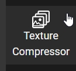
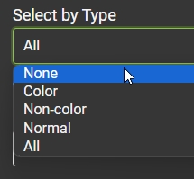
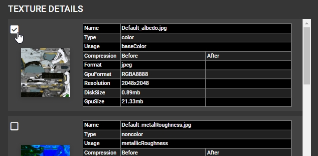
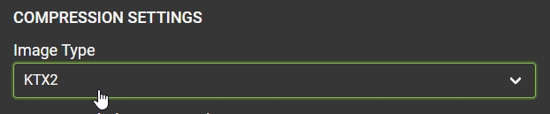
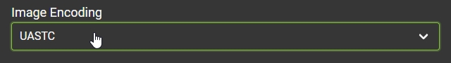
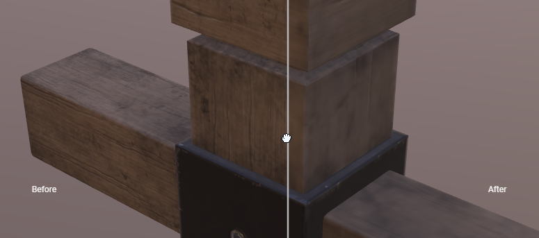
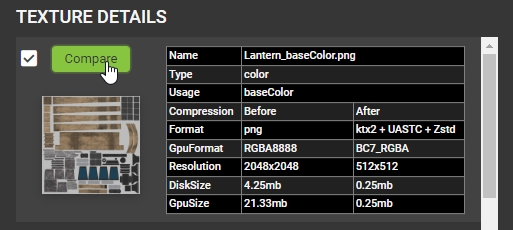
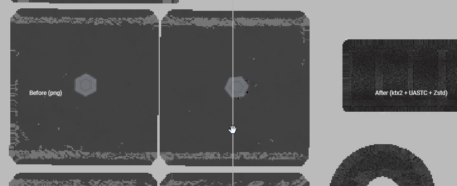
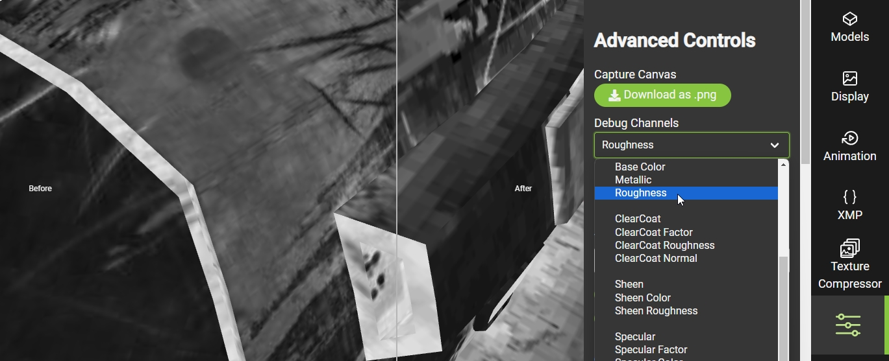
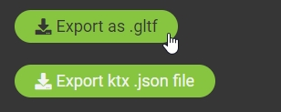

Previous: [KTX Guide for Gestaltor](KTXArtistGuide_Gestaltor.md) | Home: [KTX Artist Guide](..\KTXArtistGuide.md) | Next: [KTX Guide for glTF-Transform](KTXArtistGuide_glTF-Transform.md)

---

## KTX Guide for glTF-Compressor

[glTF-Compressor](https://github.khronos.org/glTF-Compressor-Release/) is a web-based 3D viewer with tools for compressing glTF textures. Further details about the tool can be found in the [glTF-Compressor press release](https://www.khronos.org/blog/optimize-3d-assets-with-khronos-new-gltf-compressor-tool) from The Khronos Group.

1. Open a web browser and go to [glTF-Compressor](https://github.khronos.org/glTF-Compressor-Release/).

1. Drag-and-drop a glTF asset (or use one of the existing sample assets). This can be a single .GLB file, or a .glTF file plus its textures and .BIN file. 

1. Open the _Texture Compressor_ tab:

    

4. By default, all textures are selected. To select specific textures, go to _Select by Type_ and choose _None_ then enable individual textures:

     

    

5. Multiple textures can be selected by choosing another option. _Color_ will select all color textures, such as `baseColorTexture`, `emissiveTexture`, `specularColorTexture`, etc.

6. Set the _Image Type_ to _KTX2_:

     

7. Set the _Image Encoding_ to _UASTC_. Most textures work best with _UASTC_ (see the main [KTX Artist Guide](..\KTXArtistGuide.md) page for details):

     

8. For the highest quality, set the _Level_ to _Slowest_ and enable _Supercompression_. This exposes more advanced settings below, but these can be left at their defaults unless you want to tinker.

     

9. Press _Compress Textures_ to start the encoding process. Beware! KTX encoding can be very slow as it is very taxing on your computer hardware. The button will display which texture it is currently working on. 

    

    > [!IMPORTANT]
    > If your browser warns that it is unresponsive, tell it to continue to wait. Compressing a 2k texture at the Slowest setting can take many minutes to finish processing.

10. Once compression is complete, the 3D view will show a before/after slider which can be used to examine differences:

     

11. Next to each compressed texture is a _Compare_ button, this switches the 3D view into a 2D view (or use the spacebar to toggle). Right-button-drag in the 2D view to zoom, and middle-button-drag to pan. 

     

     

12. In the 3D View, the Advanced Settings tab allows the display of individual texture channels on the 3D model. In this example the compressed Roughness texture is being soloed on the model:

     

13. Back in the _Texture Compressor_ tab, the completed file can be exported using the _Export as .gltf_ button. The KTX compression settings can also be exported to use with a command-line tool like [toktx](KTXArtistGuide_toktx.md) to batch-process multiple glTF assets with the same compression settings. 

    

---

Previous: [KTX Guide for Gestaltor](KTXArtistGuide_Gestaltor.md) | Home: [KTX Artist Guide](..\KTXArtistGuide.md) | Next: [KTX Guide for glTF-Transform](KTXArtistGuide_glTF-Transform.md)