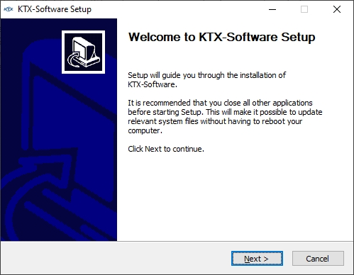
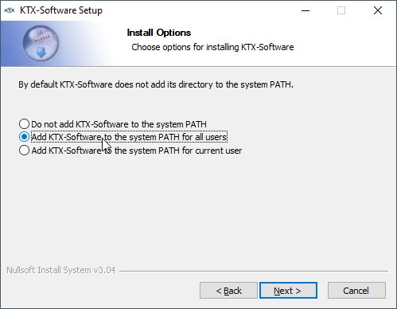
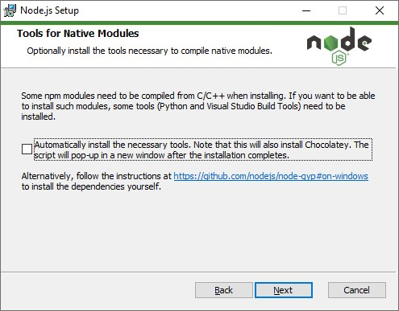
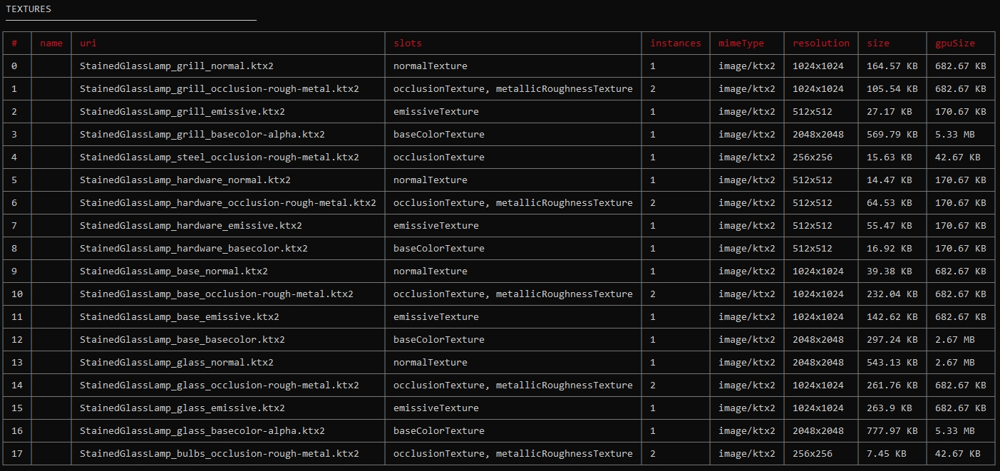

Previous: [KTX Guide for glTF-Compressor](KTXArtistGuide_glTF-Compressor.md) | Home: [KTX Artist Guide](../KTXArtistGuide.md) | Next: [KTX Guide for RapidCompact](KTXArtistGuide_RapidCompact.md)

---

## KTX Guide for glTF-Transform

[glTF-Transform](https://gltf-transform.donmccurdy.com/cli.html) is a command-line tool for glTF editing.

### Installing KTX Software

1. Go to the [KTX-Software releases](https://github.com/KhronosGroup/KTX-Software/releases).

1. Find the release you want (usually the latest). At the bottom of the release, look for the Assets section, and click the triangle to expand it.

1. Download the asset for your operating system, and install it.

1. For example, the Windows installer looks like this:



5. Add KTX-Software to the system path. This is not required, but it will make it easier to run the command line tool.



### Installing Node.js

Node.js includes the NPM node package manager, which allows you to run the javascript tool [glTF-Transform](https://gltf-transform.donmccurdy.com/cli.html), for compressing textures inside glTF using KTX texture compression.

1. Go to https://nodejs.org/en/

1. Download the asset for your operating system, and install it.

1. For example, the Windows installer looks like this:


4. You can skip “Tools for Native Modules” step by disabling the checkbox here:



### Installing glTF-Transform

[glTF-Transform](https://gltf-transform.donmccurdy.com/cli.html) is useful for compressing a bunch of textures inside a glTF model.

1. Open the OS command prompt (or PowerShell in Windows).

1. Install glTF-Transform:

``` 
npm install --location=global @gltf-transform/cli
```

### Compressing to KTX with glTF-Transform

With everything installed, you can now compress your glTF files. There are different compression options available; here are a few methods to get you started.

### METHOD 1: UASTC + ETC1S

Compress Normal and Occlusion/Roughness/Metalness (ORM) textures with UASTC, and all others with ETC1S:
```
gltf-transform uastc input.glb output1.glb --level 4 --rdo 4 --slots "{normalTexture,occlusionTexture,metallicRoughnessTexture}" --zstd 18 --verbose

gltf-transform etc1s output1.glb output2.glb --quality 255 --verbose
```

* `gltf-transform` is the tool itself.
* `uastc` is the compression method. This compresses less than etc1s, but tends to create less blocky artifacts. It creates less artifacts on textures that have uncorrelated RGB values, like ORM maps, than ETC1S does.
* `input.glb` is the file you want to compress, with PNG and/or JPEG textures inside of it. Rename this to match whatever file is being compressed.
* `output1.glb` is an interim file to save, with new KTX textures. The first step in the code block above will compress only the normal-bump and occlusion-rough-metal textures using UASTC, keeping the rest in their original formats. Then the second step will compresses the remaining textures using ETC1S.
* `--level 4` is a high quality setting. It produces the highest achievable quality, but can be very slow. If it's too slow, try 3 instead.
* `--rdo 4` is a medium quality setting, but makes smaller files. Full range is [.001, 10.0]. Lower values yield higher quality/larger LZ compressed files, higher values yield lower quality/smaller LZ compressed files. A good range to try is [.25, 10]. For normal maps, try a range of [.25, .75].
* `--slots` lets you include or exclude texture types, using the following setting:
* `"{normalTexture,occlusionTexture,metallicRoughnessTexture}"` tells glTF Transform to compress only normal and ORM textures with UASTC. To see a list of texture slots in a GLB use the command `gltf-transform inspect input.glb` This will show the dimensions and file sizes for each texture. This is particularly useful to identify the names of the `--slots` so you can apply different compression settings to different texture types.
* `--zstd 18` applies supercompression. Compression level range is [1, 22], default 18, 0 is uncompressed. Lower values are faster but give less compression. Values above 20 should be used with caution as they require more memory.
* `--verbose` shows step by step what glTF Transform is doing. On Windows there’s no progress indicator during compression, only the blinking cursor. `--verbose` is helpful as a progress bar to make sure it’s working, and to help you figure out if you included the right options or not.
* `output1.glb` is the output from the first step of the code block above, which is now used in the second step to compress the rest of the textures using ETC1S.
* `output2.glb` in the second step is the final fully-compressed model, with all textures in KTX format. Rename this to whatever output name is desired.
* `--quality 255` in the second step tells glTF-Transform to use the highest quality for ETC1S, but it applies less compression, and it takes longer to compress the files. Use this when quality is more important than conversion speed.

> 📝 NOTE: 
> This is two separate commands. The 1st command compresses only normal & ORM maps using UASTC. The 2nd command then compresses all the remaining textures using ETC1S. Start the 2nd command only after the 1st is complete. The 2nd command doesn’t need a `--slots "!{normalTexture,occlusionTexture,metallicRoughnessTexture}"` argument to omit the normal/ORM maps, because glTF-Transform will not recompress existing KTX files. It only compresses non-KTX textures.

### METHOD 2: UASTC

Compress all textures with UASTC:
```
gltf-transform uastc input.glb output.glb --level 4 --rdo-quality 4 --zstd 18 --verbose
```
* This can produce a larger file, but usually shows less compression artifacts.

### METHOD 3: ETC1S

Compress all textures using ETC1S:

```
gltf-transform etc1s input.glb output.glb --verbose
```
* This produces the smallest files, but usually creates a lot of blocky artifacts.
* Use this when file size and memory size are more important than highest visual quality.
* This also works well if textures use mostly homogenous colors. See the Duck example below.

### MORE METHODS

Try different compression settings and combinations; adjust to your overall goals for size & quality. Isolate settings to specific texture slots. Textures respond differently from each other to the various compression settings, so a little experimentation can yield better results.

To learn more about the available settings, type either of these in the command line:
* `gltf-transform help etc1s`
* `gltf-transform help uastc`

### Evaluate the Output

Check compressed files carefully in your viewer of choice.
* Look closely, there may be undesirable compression artifacts on different texture types: basecolor, alpha, normal maps, roughness, metalness, occlusion, emissive, etc.
* The [glTF Sample Viewer](https://github.khronos.org/glTF-Sample-Viewer-Release/) is a good renderer to try. You can find a list of glTF viewers using the [glTF Project Explorer](http://github.khronos.org/glTF-Project-Explorer/).

Use the `INSPECT` command to examine the file sizes for each texture and the sizes they will be in GPU memory.
```
gltf-transform inspect input.glb --format md
```
An example output of the `INSPECT` command:


MD format is easier to read directly, and can be pasted directly into a Markdown document. CSV format is great for loading into a spreadsheet for further data crunching and analysis.

---

Previous: [KTX Guide for glTF-Compressor](KTXArtistGuide_glTF-Compressor.md) | Home: [KTX Artist Guide](../KTXArtistGuide.md) | Next: [KTX Guide for RapidCompact](KTXArtistGuide_RapidCompact.md)